<p align="center">
 
 <h1 align="center">Corner detection on ZYNQ</h2>
 <p align="center"><b>Based on XC7Z020clg400-2 Soc</b></p>
</p>


<div align=center>


 [](LICENSE)


<div align=left>
[toc]

## 实验说明

实现 OV5640 摄像头实时采集图像数据并通过 ZYNQ-7 7020clg400-2 SoC 处理实现角点监测，并通过 HDMI 输出经过处理的灰度画面

## 硬件平台

- Board：Mizar Z7
- SoC：Zynq-7 XC7Z020clg400-2
- Camera：OV5640
- Screen：Xiaomi 34''

---

### Mizar Z7

#### MIZAR Z7 TOP 面器件布局图

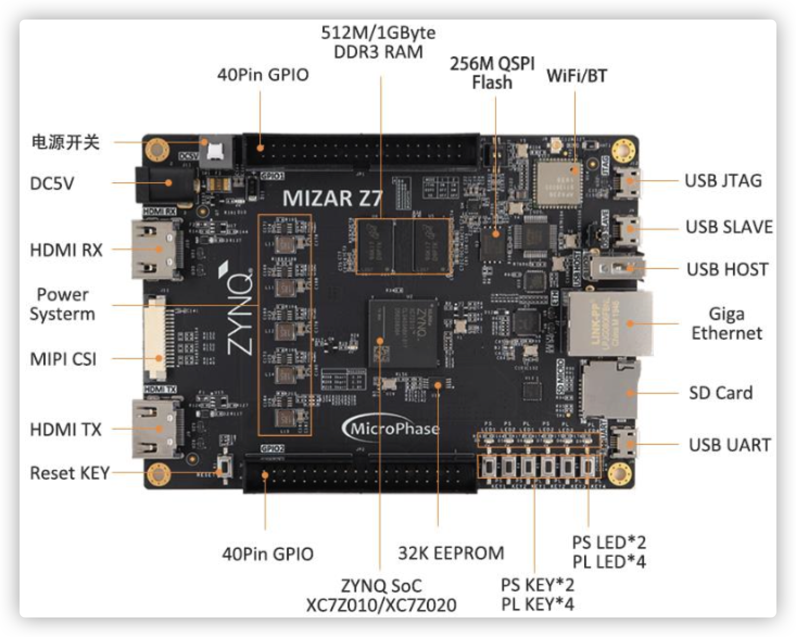

#### 原理图

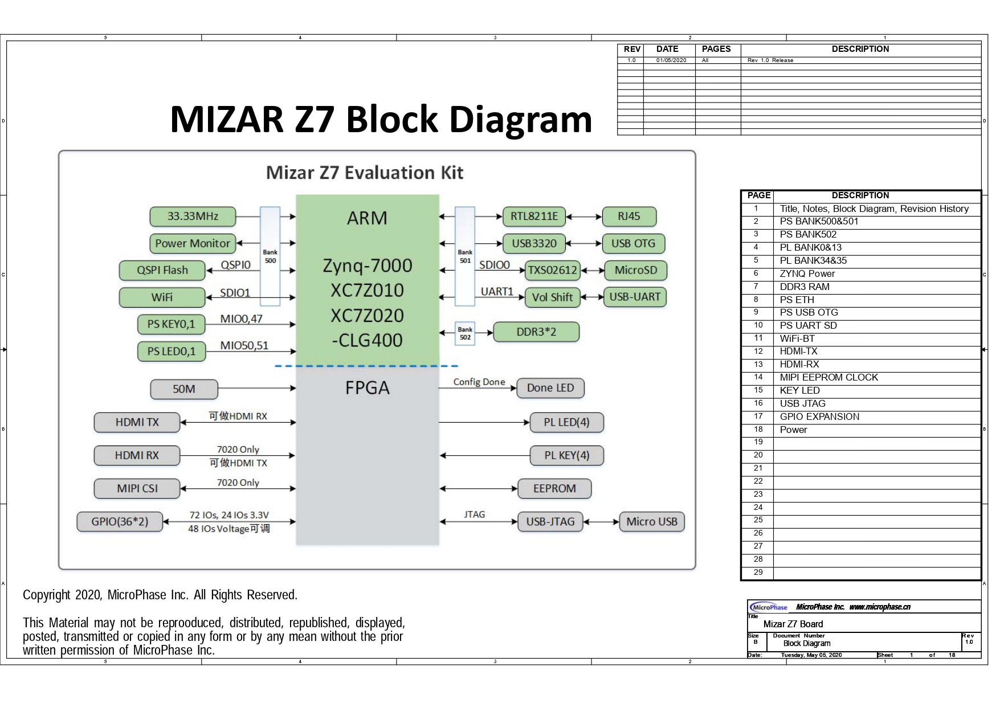

#### PS Bank 500 & 501

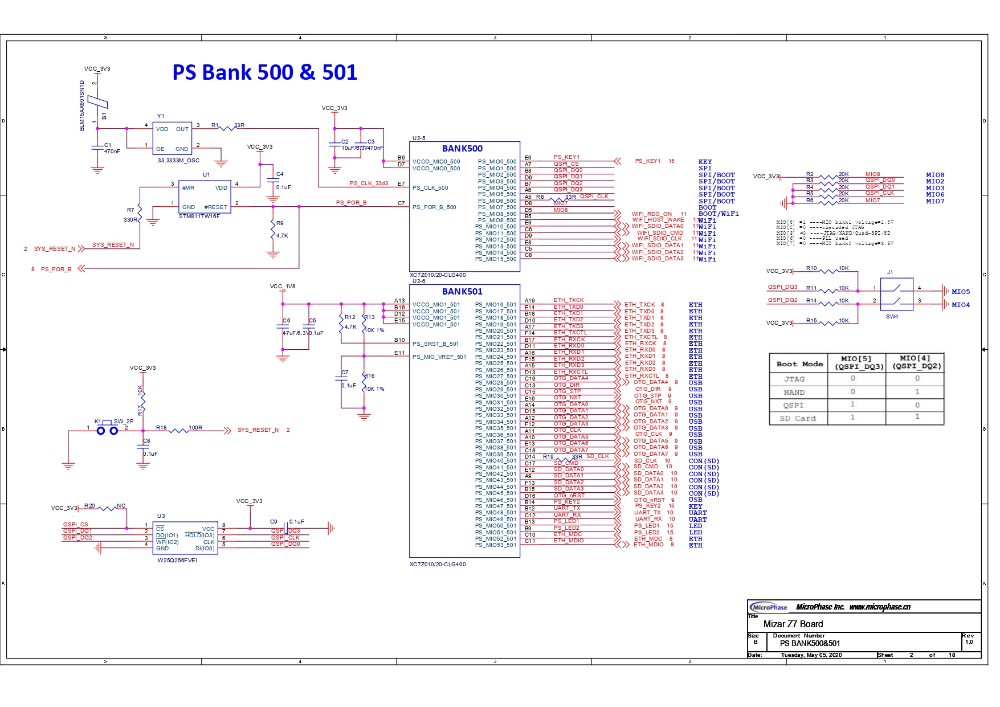

#### PL Bank 34 & 35

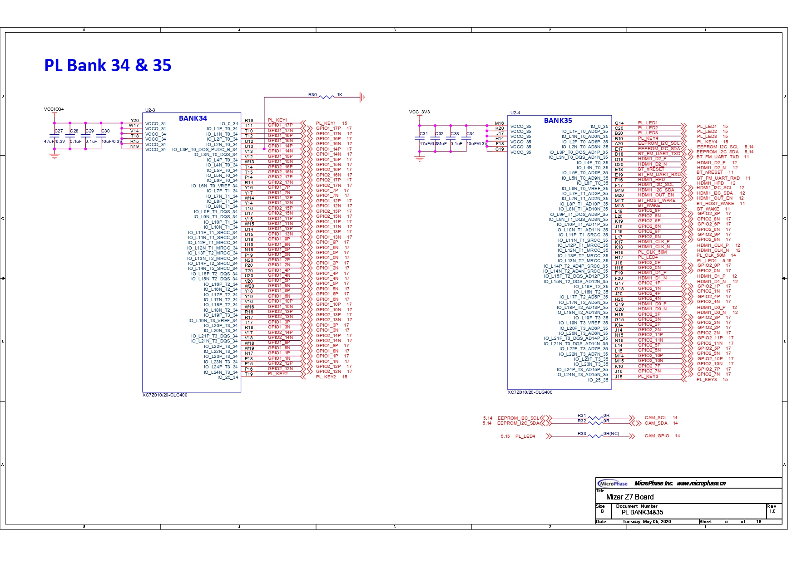

#### PL HDMI-TX

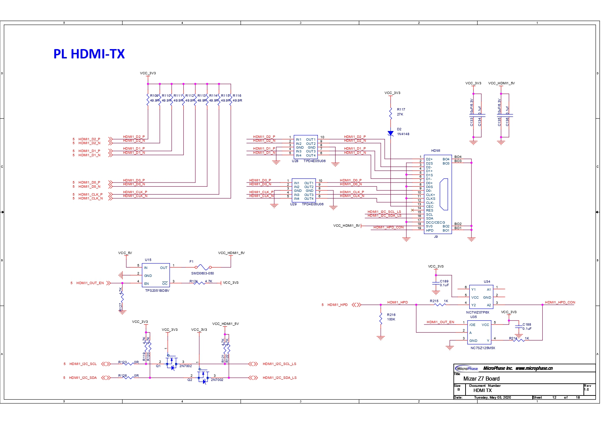

#### PL HDMI-RX

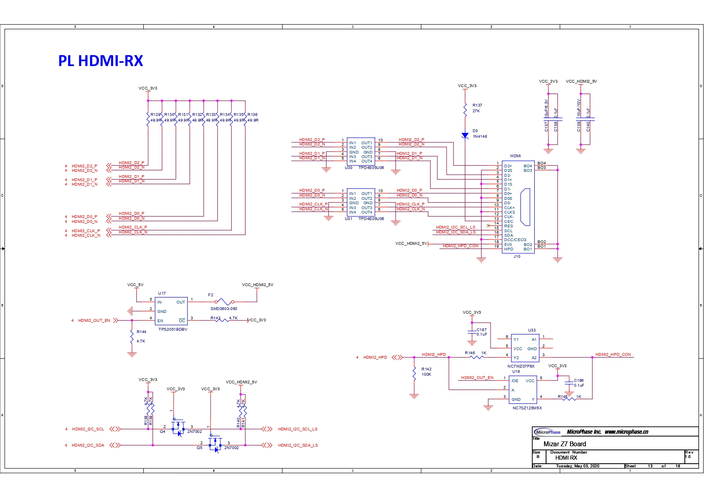


---

### OV5640

#### 简介

OV5640 是一款 1/4 英寸单芯片图像传感器，其感光阵列达到 2592*1944(即 500W 像素)，能实现最 快 15fps QSXVGA(2592*1944)或者 90fps VGA(640*480)分辨率的图像采集。传感器采用 OmniVision 推出的 OmniBSI(背面照度)技术，使传感器达到更高的性能，如高灵敏度、低串扰和低噪声。传感器内部集 成了图像处理的功能，包括自动曝光控制(AEC)、自动白平衡(AWB)等。同时该传感器支持 LED 补光、 MIPI(移动产业处理器接口)输出接口和 DVP(数字视频并行)输出接口选择、ISP(图像信号处理)以及 AFC(自动聚焦控制)等功能。

---

#### OV5640 的功能框图

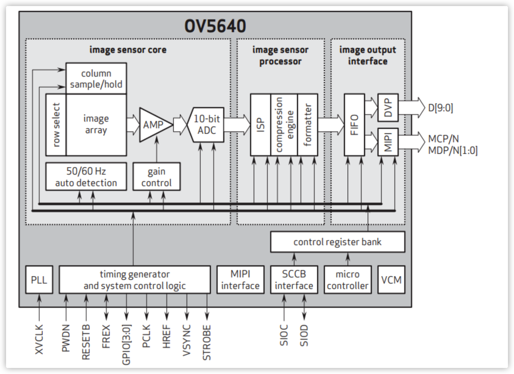

阅读 datasheet 可以知道OV5640的大致工作流程是，在图像采集传感器 image sensor core中，通过曝光和采样，在图像阵列中得到原始模拟图像数据，经过AMP对图形进行放大、校正，然后将校正后的图像通过10位的ADC芯片转换位数字信号，经过图像单元image sensor processer能够得到图像的数字信号，缓存到图像输出接口中，最终通过DVP或者MP接口将10bit数据流输出。

由上图可知：

- **时序发生器(timing generator)** 控制着**感光阵列(image array)**、**放大器(AMP)**、**AD 转换**以及输出**外部时序信号(VSYNC、HREF 和 PCLK)**，**外部时钟 XVCLK** 经过 **PLL 锁相环**后输出的时钟作为系统的控制时钟
- **感光阵列(image array)** 将光信号转化成模拟信号，经过**增益放大器(AMP)** 之后进入 10 位 AD 转换器
- **AD 转换器**将模拟信号转化成数字信号，并且经过 ISP（图像信号处理） 进行相关图像处理，最终输出所配置格式的 10 位视频数据流。

**【重点】** 其中，增益放大器控制以及 ISP 等都可以通过寄存器(registers)来配置，**外部通过 SCCB 总线来进行寄存器的配置**，**SCCB 总线接口协议兼容 IIC 协议，所以本实验中我们使用模拟 IIC 的方式来配置相关寄存器。** 

---

#### SCCB 接口总线

SCCB（Serial Camera Control Bus，串行摄像头控制总线）是由 OV（OmniVision 的简称）公司定义和发展的三线式串行总线，**该总线控制着摄像头大部分的功能，包括图像数据格式、分辨率以及图像处理参数等**。OV 公司为了**减少传感器引脚的封装，现在 SCCB 总线大多采用两线式接口总线**

**OV5640 使用的是两线式 SCCB 接口总线，用 16 位(两个字节)表示寄存器地址。**

**OV5640 SCCB 的写传输协议如下图所示：**

在 OV5640 众多寄存器中，有些寄存器是可改写的，有些是只读的，只有可改写的寄存器才能正确写入

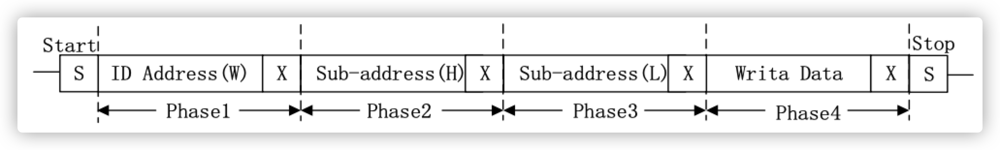

- `ID ADDRESS` - 是由 7 位器件地址和 1 位读写控制位构成(0:写 1:读)，OV5640 的器件地址为 7’h3c，所以在**写**传输协议中，ID Address(W)= 8’h78(器件地址左移 1 位，低位补 0)
- `Sub-address(H)` - 为高 8 位寄存器地址
- `Sub-address(L)` - 为低 8 位寄存器地址
- `Write Data` - 为 8 位写数据，每一个寄存器地址对应 8 位的配置数据

---

#### 上电和复位

OV5640 需要满足一定的上电要求，才能正常工作

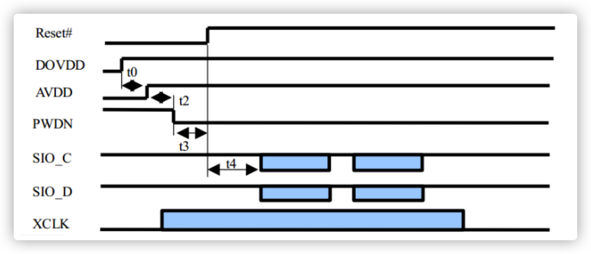

- t0: >= 0 毫秒：从 DOVDD 稳定到 AVDD 稳定之间的时间
- t2: >= 5 毫秒：从 AVDD 稳定到传感器上电稳定之间的时间
- t3: >= 1 毫秒：传感器上电稳定到 ResetB 拉高之间的延迟
- t4: >=20 毫秒：ResetB 拉高到 SCCB 初始化之间的延迟

步骤：

1. ResetB 拉低，复位 OV5640 。PWDN 引脚拉高
2. DOVDD 和 AVDD 上电，这两路最好同时上电
3. 等 AVDD 稳定 5 毫秒后，拉低 PWDN 
4. PWDN 置低 1 毫秒后,拉高 ResetB
5. 20 毫秒后, 初始化 OV5640 的 SCCB 寄存器设置


---

## 软件平台

- Vivado v2018.3
- Xilinx SDK v2018.3
- Vivado HLS v2018.3

## 实验流程部分

1. HLS 开发部分
2. Vivado 设计部分
3. Xilinx SDK 程序设计部分
4. 开发板验证

### 系统架构框图

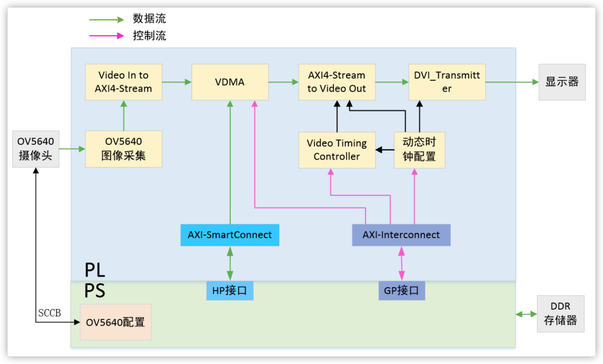


## 流程

### 1.  HLS 开发部分

#### 1) 工程新建及配置

1. 打开 Vivado HLS v2018.3 并选择 `Create New Project`，输入项目名称和路径

   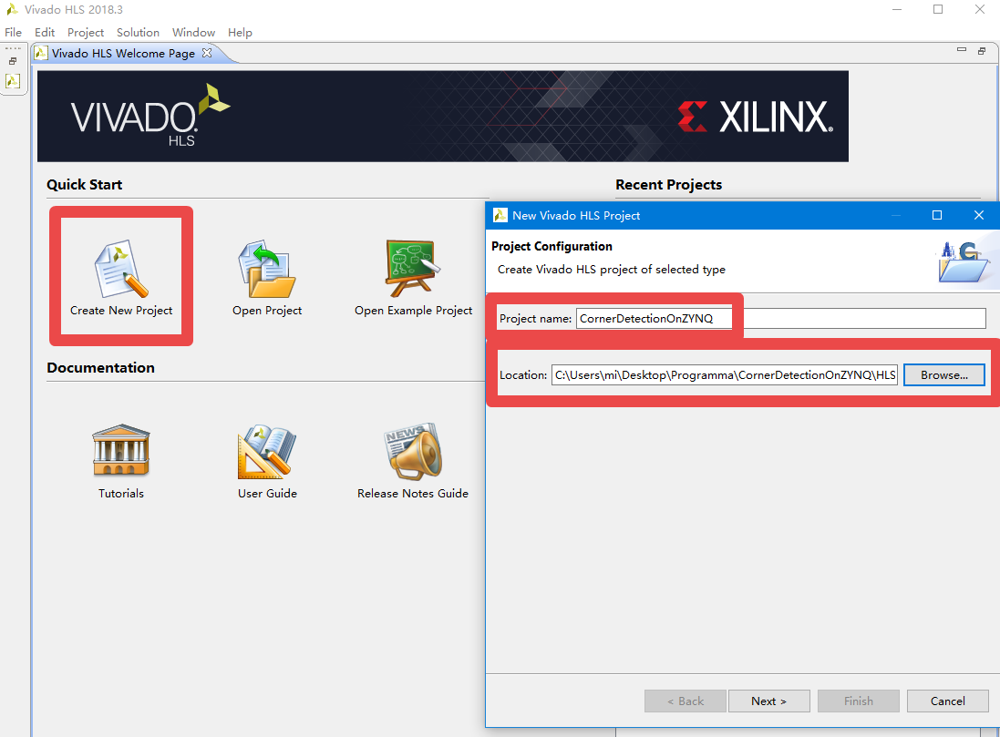

2. 点击 `Next`，在 `Solution Configuration` 处选择 `xc7z020clg400-2`

   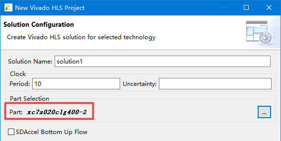


#### 2) 实现代码的导入

1. 在 `Source` 处导入测试图片文件及以下代码

   - CornerDetect.h

     ```C++
     #ifndef __CORNER_HEAD_H_
     #define __CORNER_HEAD_H_
     
     #include "hls_video.h"
     #include "ap_axi_sdata.h"
     
     //定义图像的大小
     #define WIDTH 1024
     #define HEIGHT 768
     
     //定义输入输出图像
     #define SRC_IMAGE "screen.bmp"		//输入图像路径
     #define DST_IMAGE "DstImage.bmp"	//输出图像路径
     #define GOLD_IMAGE "GoldImage.bmp"	//参考图像路径
     
     //定义图像数据类型
     
     //定义AXI-Stream数据流
     typedef ap_axiu<24,1,1,1> int_sideChannel;
     typedef hls::stream<ap_axiu<24,1,1,1> > AXI_STREAM ;
     
     //定义图像矩阵，其中图像矩阵中的像素格式为3通道8位无符号数，RGB图像
     typedef hls::Mat<HEIGHT,WIDTH,HLS_8UC3> IMAGE_RGB;
     
     //定义图像矩阵的每个像素格式，3通道8位无符号型
     typedef hls::Scalar<3,unsigned char> PIXEL_RGB;
     
     //定义图像矩阵，其中图像矩阵中的像素格式为1通道8位无符号数，灰度图像
     typedef hls::Mat<HEIGHT,WIDTH,HLS_8UC1> IMAGE_GRAY;
     
     //定义图像矩阵的每个像素格式，1通道8位无符号型
     typedef hls::Scalar<1,unsigned char> PIXEL_GRAY;
     
     
     //top function
     void rgb2gray(IMAGE_RGB & imgIn, IMAGE_RGB & imgOut_3C, IMAGE_GRAY & imgOut_1C);
     void doCorner(AXI_STREAM & inStream,AXI_STREAM & outStream);
     #endif
     ```

   - CornerDetect.cpp

     ```C++
     #include "CornerDetect.h"
     
     void rgb2gray(IMAGE_RGB & imgIn, IMAGE_RGB & imgOut_3C, IMAGE_GRAY & imgOut_1C){
     	PIXEL_RGB 	pixIn;
     	PIXEL_RGB 	pixOut_3C;
     	PIXEL_GRAY	pixOut_1C;
     
     	for(int idxRow = 0; idxRow < HEIGHT; idxRow++){
     		for(int idxCol = 0; idxCol < WIDTH; idxCol++){
     			//输入图像是三通道的RGB图像
     			imgIn >> pixIn;
     			unsigned short R = pixIn.val[0];
     			unsigned short G = pixIn.val[1];
     			unsigned short B = pixIn.val[2];
     
     			//输出三通道图像，各个通道都是灰度值，最终显示出来的图像是灰度图
     			pixOut_3C.val[0] = (unsigned char) ((R*76 + G*150 + B*30) >> 8);
     			pixOut_3C.val[1] = (unsigned char) ((R*76 + G*150 + B*30) >> 8);
     			pixOut_3C.val[2] = (unsigned char) ((R*76 + G*150 + B*30) >> 8);
     
     			//输出单通道图像，只有一个通道，为灰度图像
     			pixOut_1C.val[0] = (unsigned char) ((R*76 + G*150 + B*30) >> 8);
     			imgOut_3C << pixOut_3C;
     			imgOut_1C << pixOut_1C;
     		}
     	}
     }
     
     void doCorner(AXI_STREAM & inStream,AXI_STREAM & outStream){
     #pragma HLS INTERFACE axis  port=outStream
     #pragma HLS INTERFACE axis  port=inStream
     #pragma HLS INTERFACE s_axilite port=return bundle=CTRL_BUS
     
     
     	IMAGE_RGB img_0;
     	IMAGE_RGB img_1;
     	IMAGE_GRAY img_2;
     	IMAGE_RGB img_3;
     	IMAGE_GRAY mask;
     	IMAGE_GRAY dmask;
     
     #pragma HLS dataflow
     #pragma HLS stream depth=20000 variable=img_1_.data_stream
     	hls::AXIvideo2Mat(inStream, img_0);
     	PIXEL_RGB color(255,255,0);
     	rgb2gray(img_0, img_1, img_2);
     	hls::FASTX(img_2, mask, 20, true);			// 快速脚点检测
     	hls::Dilate(mask, dmask);					//对检测出来的点进行膨胀
     	hls::PaintMask(img_1, dmask, img_3, color);		//将膨胀后的点添加到图像
     	hls::Mat2AXIvideo(img_3, outStream);
     }
     ```

2. 在 `Test Bench` 处导入以下测试文件

   ```C++
   #include <stdio.h>
   #include <opencv2/opencv.hpp>
   #include "CornerDetect.h"
   #include "hls_opencv.h"
   using namespace cv ;
   
   
   //图片比对
   int image_compare(const char* output_image, const char* golden_image) {
       if (!(output_image) || !(golden_image)) {
           printf("Failed to open images...exiting.\n");
           return -1;
       } else {
           Mat o = imread(output_image);
           Mat g = imread(golden_image);
           assert(o.rows == g.rows && o.cols == g.cols);	//assert如果正确，则继续运行后面的程序，否则报错
           assert(o.channels() == g.channels() && o.depth() == g.depth());
           printf("rows = %d, cols = %d, channels = %d, depth = %d\n", o.rows, o.cols, o.channels(), o.depth());
           int flag = 0;
           for (int i = 0; i < o.rows && flag == 0; i++) {
               for (int j = 0; j < o.cols && flag == 0; j++) {
                   for (int k = 0; k < o.channels(); k++) {
                       unsigned char p_o = (unsigned char)*(o.data + o.step[0]*i + o.step[1]*j + k);
                       unsigned char p_g = (unsigned char)*(g.data + g.step[0]*i + g.step[1]*j + k);
                       if (p_o != p_g) {
                           printf("First mismatch found at row = %d, col = %d\n", i, j);
                           printf("(channel%2d) output:%5d, golden:%5d\n", k, p_o, p_g);
                           flag = 1;
                           break;
                       }
                   }
               }
           }
           if (flag)
               printf("Test Failed!\n");
           else
               printf("Test Passed!\n");
   
           return flag;
       }
   }
   
   int main(){
   	IplImage * SrcImage;				//输入的图像
   	IplImage * DstImage;				//输出的图像
   	SrcImage = cvLoadImage(SRC_IMAGE,-1);//导入图像
   
   	//创建opencv支持的输出的图像
   	DstImage = cvCreateImage(cvGetSize(SrcImage),SrcImage->depth, SrcImage->nChannels);
   	//AXI-Stream数据流
   	AXI_STREAM inStream;
   	AXI_STREAM outStream;
   
   	IplImage2AXIvideo(SrcImage,inStream);
   
   	//可综合的函数
   	doCorner(inStream, outStream);
   	//保存输出结果
   	AXIvideo2IplImage(outStream,DstImage);
   	cvSaveImage(DST_IMAGE,DstImage);
   
   	//参考图像输出
   	cvShowImage(DST_IMAGE, DstImage);
   	cvWaitKey(0);
   
   
   	//释放图片
   	cvReleaseImage(&SrcImage);
   	cvReleaseImage(&DstImage);
   	return 0;
   }
   ```


#### 3) 综合及仿真

1. 在确认代码无误后，依次执行：

   1. Run C Simulatoin（仿真）

   2. Run C Synthesis（综合）

   3. Run C/RTL Cosimulation（联合仿真）

   4. Export RTL（导出 RTL）

       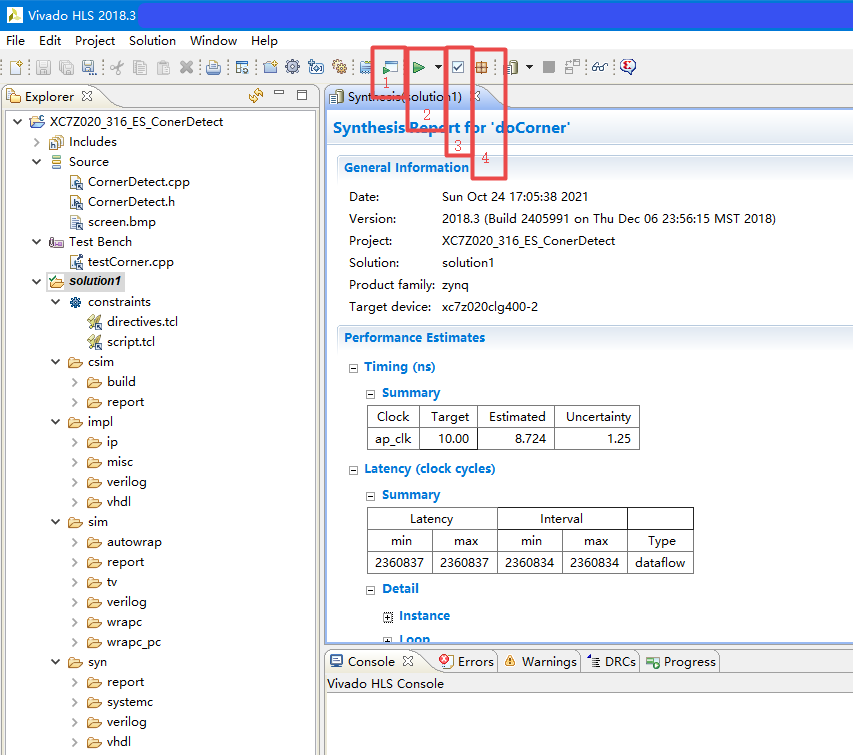

   至此，我到了我们所需要的图像处理 IP

---


### 2. Vivado 设计部分

#### 1) 新建工程

新建 Vivado 工程，Soc 选择 `xc7z020clg400-2`


#### 2) 导入自定义IP核

如图所示：

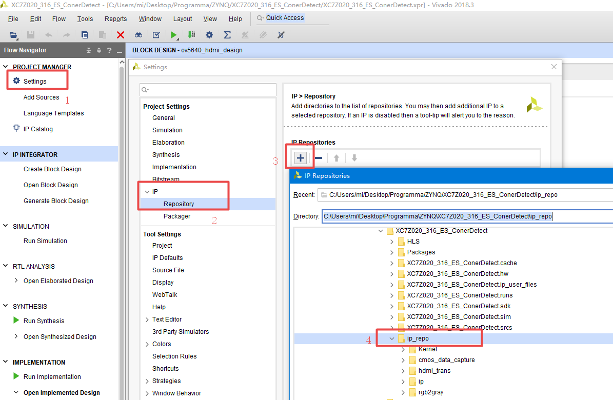

#### 4) 添加 `ZYNQ-7` IP核

- 使能 UART 端口

- Bank 1 的电压改为 1.8V

  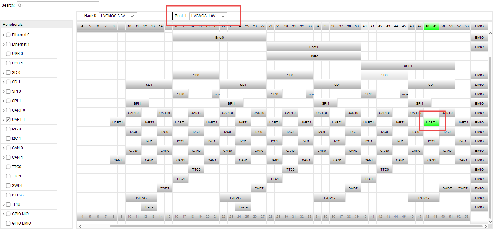

- 引出对应引脚

  配置完成如下图所示：

  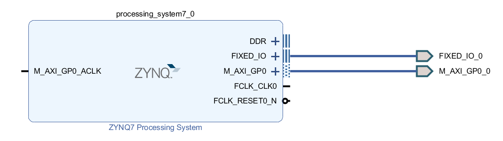
  
  

#### 5) 添加 OV5640 摄像头 IP 核

**信号说明：**

| 信号名             | 方向   | 端口说明                 |
| ------------------ | ------ | ------------------------ |
| clk                | input  | 时钟                     |
| rst                | input  | 复位信号                 |
| cmos_cfg_done      | input  | 寄存器配置完成信号       |
| cmos_pclk          | input  | cmos 数据像素时钟        |
| cmos_vsync         | input  | cmos 场同步信号          |
| cmos_href          | input  | cmos 行同步信号          |
| cmos_data[9:0]     | input  | cmos 数据                |
| pclk               | output | pixel out clock          |
| cmos_data_vld      | output | frame is active flag     |
| cmos_clk_en        | output | cmos clock enable siagnl |
| capture_data[23:0] | output |                          |
| vsync              | output |                          |

**配置：**

添加 OV5640 摄像头 IP 核，并将连接外部引脚的端口信号引出，修改信号名称方便辨识及引脚约束。需引出信号如下图所示：

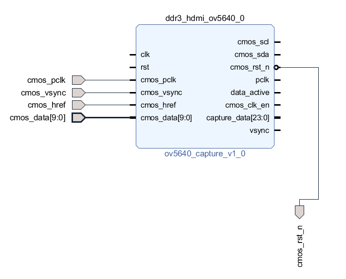

将PS 端的输出时钟作为该 IP 的驱动时钟，连接时钟信号如下图所示：

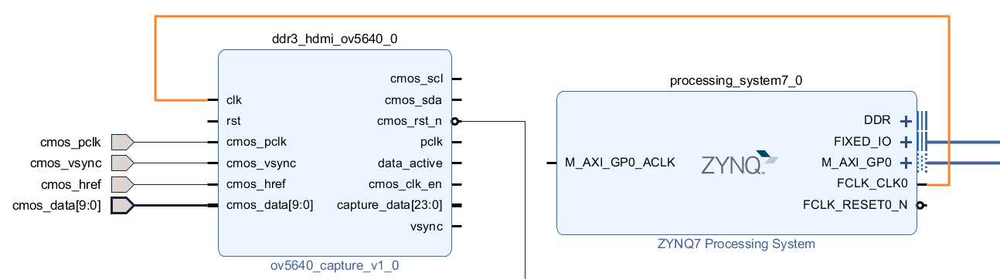


#### 6) 添加 Video In to AXI4-Stream IP 核（视频输出控制器）

**IP核介绍：**

 Video In to AXI4-Stream IP 核用于将视频源（带有同步信号的时钟并行视频数据，即同步sync或消隐blank信号或者而后者皆有）转换成AXI4-Stream接口形式，实现了接口转换。该IP还可使用VTC核，VTC在视频输入和视频处理之间起桥梁作用。

**配置：**

设置时钟模式为独立模式（Independent），如下图所示：

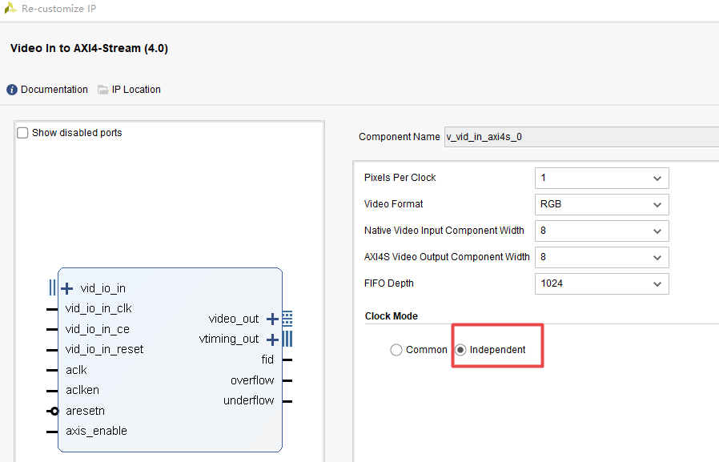

并将 OV5640 的摄像头信号进行以下连接：

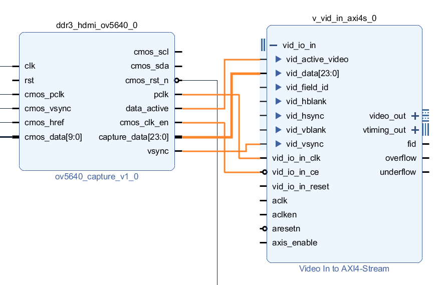


#### 7) 添加 Clocking Wizard IP核

**IP核介绍：**

提供特定频率的时钟信号

**配置：**

设置输入时钟频率为50Mhz，设置输出时钟1 的输出频率为65Mhz，输出时钟2 的频率为325Mhz，设置复位信号为低电平有效。如下图所示：

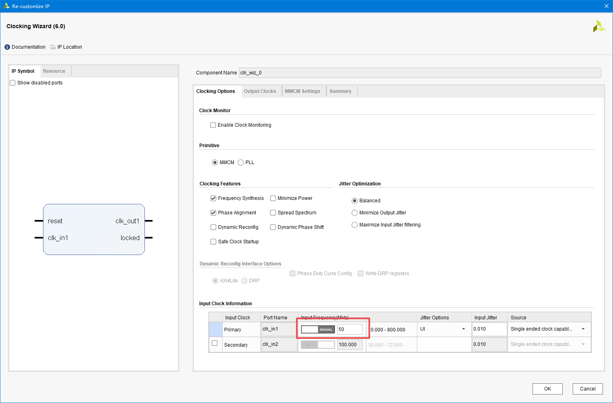

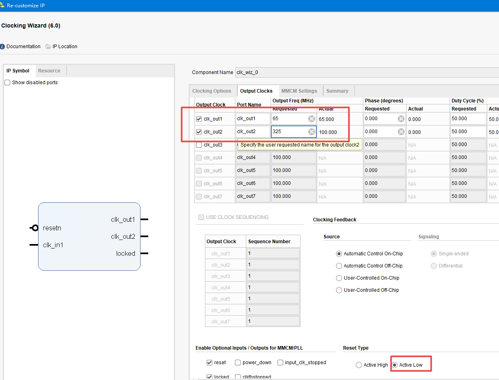


#### 8) 添加 Vector Logic 逻辑门电路IP

**IP核介绍：**

简单的逻辑门电路

**配置：**

设置门电路为1位并取反


设置完成后连接相关信号：

- 时钟 IP 的时钟信号 clk_in1 连接 ps 端输出时钟， 复位信号连接 ps 端输出复位信号
- ov5640_capture 的时钟输入 clk 连接 ps 端输 出时钟信号，复位信号为**高有效**，将 ps 端输出复位信号经过非门之后连接倒复 位信号输入端。
- video in to AXI4-Stream IP 的时钟信号 aclk 连接 ps 端的输出时钟。 

连接时钟和复位信号如下所示：

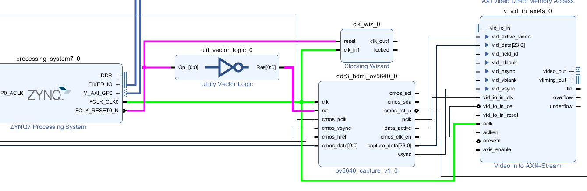


#### 9) 添加两个 VDMA IP

> 使用 VDMA IP 核来实现对于 AXI4-Stream 类目标外设的高带宽直接存储器存储或读取来读取 DDR 中的数据。VDMA 读取到数据之后通过 AXI4-Stream to Video Out IP 核将数据流转换成视频协议的数据流

**VDMA IP核介绍：**

AXI VDMA(AXI Video Direct Memory Access，以下简称 VDMA)， 是 Xilinx 提 供的软核 IP。该 IP 可以看作 DMA 的升级版，提供了一些适用于视频图像应用的 功能。与 DMA 类似，该 IP 可以为存储器或者 AXI4-Stream 类目标外设之间提供 高带宽直接存储器存取。在此基础上增加了帧缓存的缓冲机制和同步锁相 (GenLock)等功能，同时集成了视频专用功能，如帧同步和 2D DMA 传输等， 非常适合基于 ZYNQ 架构上的图像和视频处理应用。

AXI VDMA 是 Xilinx 提供的软核 IP，用于将 AXI Stream 格式的数据流转换为 Memory Map 格式或将 Memory Map 格式的数据转换为 AXI Stream 数据流，从而实现与 DDR3 进行通信。

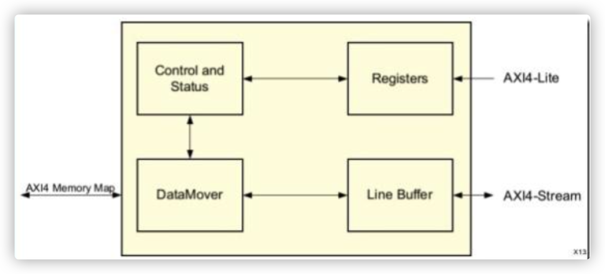

主要有以下几种接口类型：

- **AXI-lite: PS 通过该接口来配置 VDMA**
- AXI Memory Map write：映射到存储器写
-  AXI Memory Map read：映射到存储器读
- **AXI Stream Write (S2MM)：AXI Stream 视频流写入图像**
- **AXI Stream Read (MM2S)：AXI Stream 视频流读出图像**

从框图中可以看出，VDMA 主要由控制和状态寄存器、数据搬运模块、行缓 冲这几部分构成。数据进出 DDR 要经过行缓冲进行缓存，然后由数据搬运模块 写入或者读出数据。数据搬运模块具体如何工作，由相关寄存器负责控制。VDMA 的工作状态可以通过读取状态寄存器进行获取。


**相关概念：**

- **帧缓存**

    在日常生活中我们知道想要实现流畅的视频播放至少需要 24 帧/秒，即每秒 播放 24 幅图像。一般在图像处理设备中图像输入源和图像显示的传输速率是不匹配的(如图像输入源传输速度较快或者图像显示端传输速度较快)，在这种时 候直接读取输入源来显示显然是不合适，时候就需要一片存储区域来缓存输入的数据，以便显示设备读取使用，同时方便后续对视频数据做图像处理。这就是帧 缓存存储器(Frame Buffer)，简称帧缓存，也常被称作显存。帧缓存的每一个存储单元对应屏幕上的一个像素，整个帧缓存对应一帧图像。

    在使用帧缓存来缓存图像数据时，可以采用单帧缓存或多帧缓存的方案。 **单帧缓存是指图像的输入和图像的显示都是通过读写同一片存储区域来实现的**。 而**多帧缓存是指将不同的图像保存在不同的存储区域，显示时按顺序读取**。显而 易见，单帧缓存存在一个缺陷，那就是当数据源连续输入的时候，帧缓存保存的 就可能是两帧或更多帧图像数据叠加的结果，当显示设备读取显示的时候就会出 现图像割裂的现象。所以单帧缓存适用于输入速率小于读取速率的应用场景。**对于摄像头图像显示或视频播放就需要用到多帧缓存**。

- **同步锁相**

    实际应用场景中，为解决图像输入端和输出端的数据速率不匹配导致的潜 在错误通常使用多帧缓存来保存数据。图像输入端在写入其中一个帧缓存时，输 出端读取其它的帧缓存。这就涉及到帧缓存的读写策略，即同步锁相模式。

    VDMA 支持四种同步锁相模式，分别是 Genlock Maste(r 同步锁相主模式)、 Genlock Slave(同步锁从模式)、 Dynamic Genlock Master(动态同步锁相主模式) 和 Dynamic Genlock Slave(动态同步锁相从模式)。

    **VDMA 有一个写通道(S2MM)和一个读通道(MM2S)，用户通过写通道将 输入端数据写入帧缓存，通过读通道将从帧缓存中读出数据。** VDMA 的每一个 通道都可以选择以上四种模式中的一种，接下来我们分别向大家介绍这四种同步模式。

    - Genlock Master(同步锁相主模式)

        当写通道(S2MM)或者读通道(MM2S)配置为 Genlock Master 时，该 通道不会跳过或者重复任一帧缓存区域，按照帧缓存顺序读出数据。配置为 Genlock Slave 的通道应当紧跟 Genlock Master 通道变化，但有一定的延迟，延 迟的大小在寄存器(*frmdly_stride[28:24])中配置。

    - Genlock Slave(同步锁从模式)

        当写通道(S2MM)或者读通道(MM2S)配置为 Genlock Slave 时，该通 道会通过跳过或者重复一些帧缓存区域的方式，尝试与 Genlock Master 通道同 步。

    - Dynamic Genlock Master(动态同步锁相主模式)

        当写通道(S2MM)或者读通道(MM2S)配置为 Dynamic Genlock Master 时， 该通道会跳过 Dynamic Genlock Slave 通道正在操作的帧缓存，通过跳过或者重 复一些帧缓存区域的方式来完成。

    - Dynamic Genlock Slave(动态同步锁相从模式)

        当写通道(S2MM)或者读通道(MM2S)配置为 Dynamic Genlock Slave 时，该通道会操作 Dynamic Genlock Master 通道上一周期操作的帧。

        

    在实际应用中，如果避开读通道和写通道同时访问同一帧缓存，那么 VMDA 必须配置成动态同步锁相的模式，且帧缓存数量要大于等于 3。

在本实验中，我们将利用 AXI VDMA 和 HDMI 信号输出的 IP，利用开发板输出 HDMI 信号，在电脑显示器上显示图片。


**配置：**

- `Frame Buffers` 选项可以选择 AXI VDMA 要处理的帧缓冲存储位置 的数量。由于本次显示实验只显示一张图片，数据只需要写入一次，因此不需要 设置多个帧缓存区域，这里设置为 1。因为本实验是从 DDR3 中读取数据输出给 LCD，所以只需要勾选 Enable Read Channel 就可以了，无需勾选 Enable Write Channel
- `Memory Map Data Width` 选项可以为 MM2S 通道选择所需的 AXI4 数据宽度。此处保持默认 64 即可
- `Write/Read Burst Size` 用于指定突发写/读的大小，此处选择 32
- `Stream Data Width` 选 项可以选择 MM2S 通道的 AXI4-Stream 数据宽度。 有效值是 8 的倍数，最大 到 1024。 必须注意的是该值必须小于或等于 Memory Map Data Width。**此处因输出数据格式为 RGB888，设置为 24**
- `Line Buffer Depth` 选项可以选择 MM2S 通道的行缓冲深度（行缓冲区宽度 为 stream data 的大小） ，此处设置 **512**

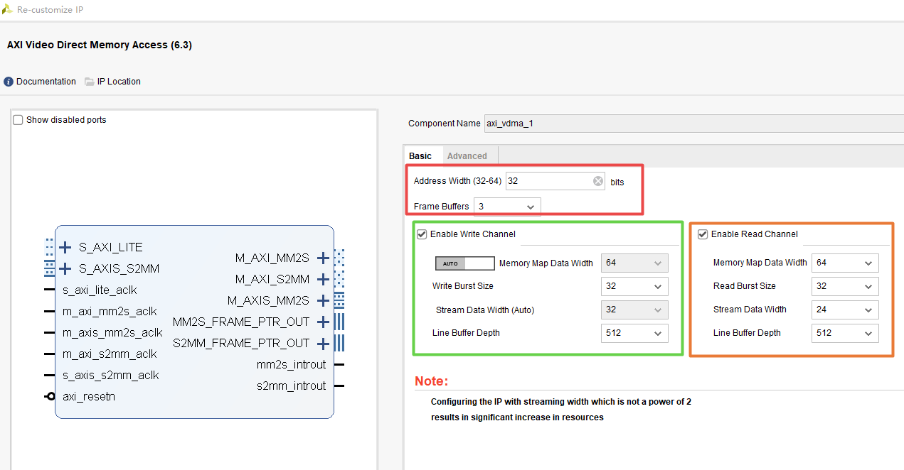


#### 10) 添加在 HLS 中生成的自定义视频处理 IP 核

**配置：**

1. 连接视频输出输入信号

    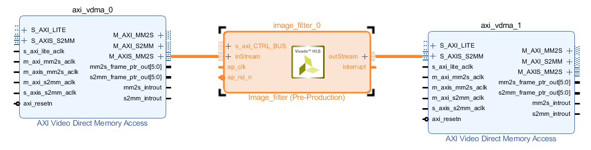

2. 连接 Video in to AXI4-Stream IP 的视频信号输出端口 `video_out` 和 VDMA 的数据输入端口 `S_AXIS_S2MM`。

    如下图所示：

    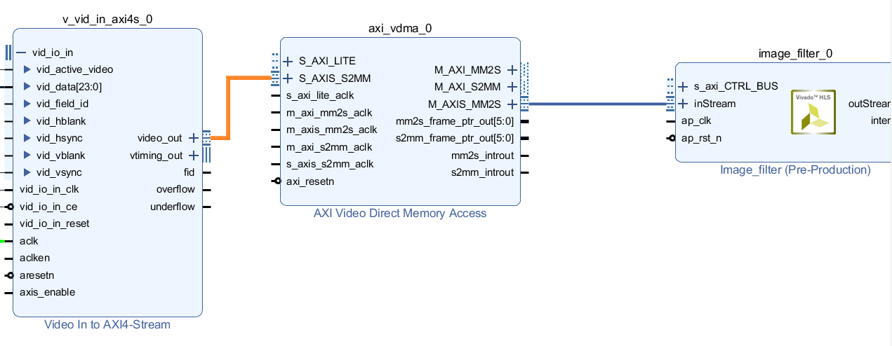


#### 11) 添加 Video Timing Controller IP核 （视频时序控制器）

**IP核介绍：**

使用这个模块，来产生不同的分辨率下时序控制信号

**配置：**

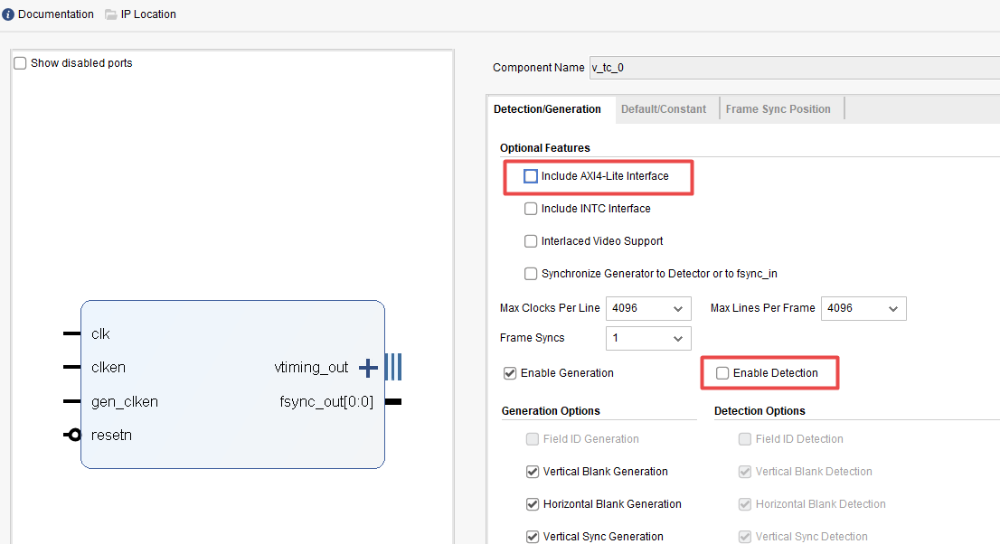

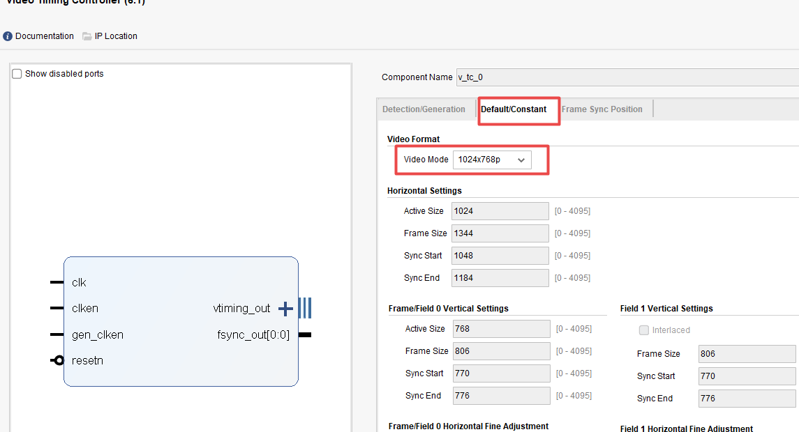

连接IP 核的输入时钟信号及复位信号，如下图所示:

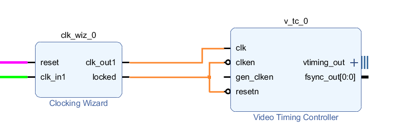


#### 12) 添加 AXI-Stream to Video out（视频输出控制器）

**IP核介绍：**

这个模块将 VDMA 从 DDR 读出的 AXI4-Stream 转换成 RGB 图像数据

**配置：**

这里我们使用了独立时钟作为输入，所以选择独立时钟

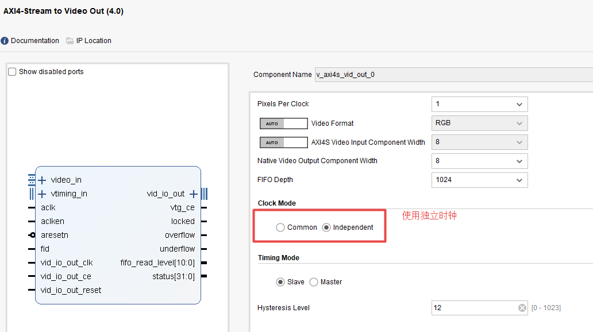

并且添加非门逻辑电路，之后如下图所示连接相关信号

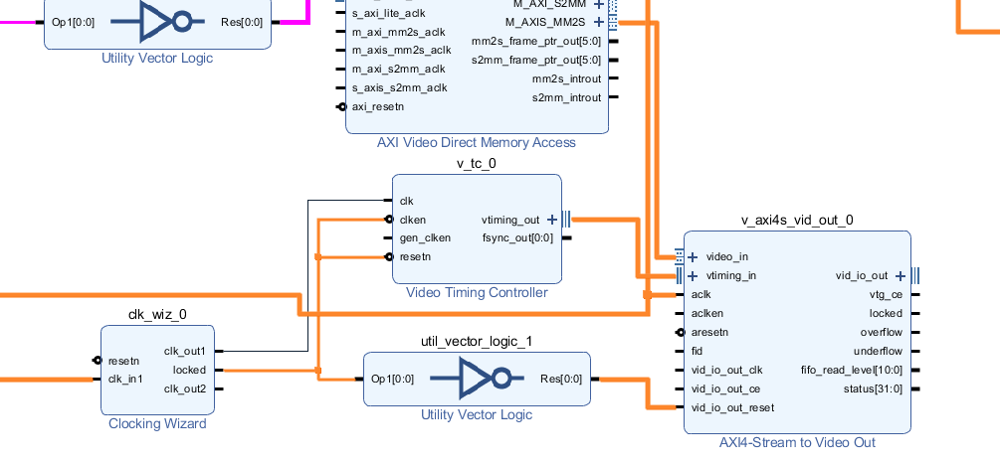

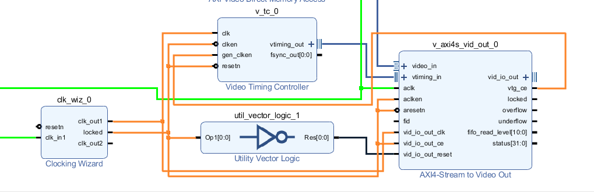


#### 13) 添加 HDMI IP

我们这里的 HDMI 采用 IP核的方式进行使用。在本实验中，我们利用了 VDMA 的 IP核实现了 HDMI 的图像输出。

**信号说明：**

| 信号名          | 方向   | 端口说明           |
| --------------- | ------ | ------------------ |
| clk1x           | input  | Clock              |
| clk5x           | input  | Clock              |
| rst             | input  | 异步复位高电平有效 |
| image_rgb[23:0] | input  | 输入R分量          |
| vsync           | input  | 场同步信号         |
| hsync           | input  | 行同步信号         |
| de              | input  | 输出数据有效信号   |
| hdmi_tx_clk_n   | output | TMDS时钟           |
| hdmi_tx_clk_p   | output | TMDS时钟           |
| hdmi_tx_chn_r_n | output | TMDS数据           |
| hdmi_tx_chn_r_p | output | TMDS数据           |
| hdmi_tx_chn_g_n | output | TMDS数据           |
| hdmi_tx_chn_g_p | output | TMDS数据           |
| hdmi_tx_chn_b_n | output | TMDS数据           |
| hdmi_tx_chn_b_p | output | TMDS数据           |

**配置：**

将所有输出信号引出并修改信号名称

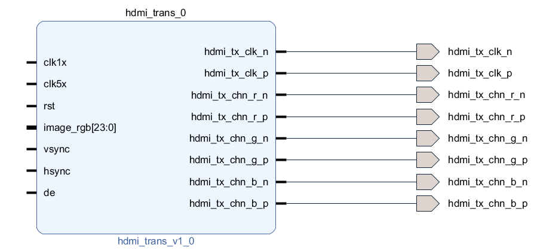

连接信号如下图所示：

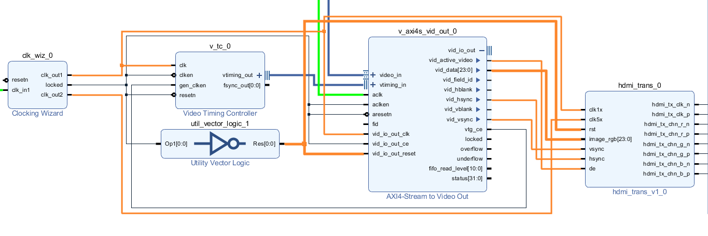


#### 14) 添加 Constant IP

**IP核介绍：**

增加一个常量输出模块 Constant，这里我们需要将 hdmi_opn 拉高，使其始终处于工作状态

**配置：**

设置输出位宽为1，输出高电平1 作为HDMI 输出使能信号

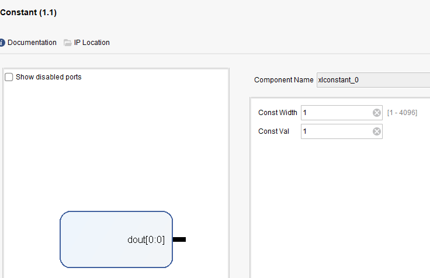

导出引脚

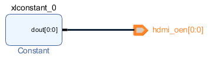


#### 15) 添加 Processor System Reset IP

**IP核介绍：**

提供复位信号

**配置：**

按以下方式连接：

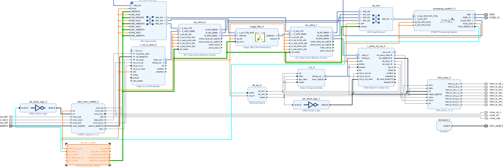


#### 16) 点击 Run Connection Automation 自动连接信号


#### 17) 得到最终的 Block Deign

最终得到的 Block Deign 如下图所示：

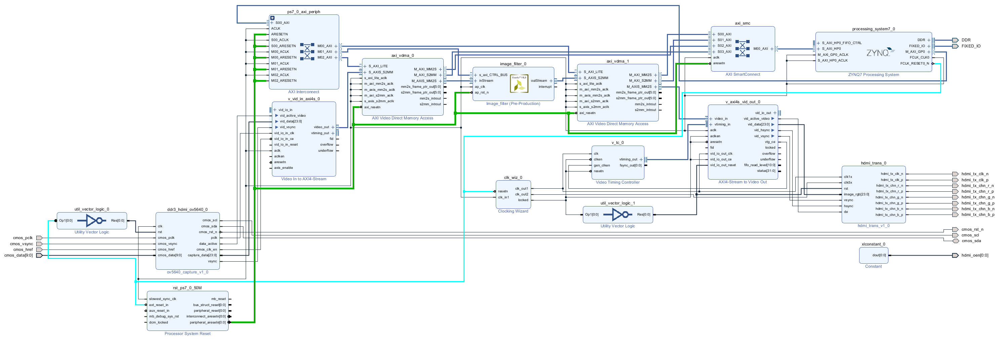


#### 18) 生成顶层 HDL 文件

#### 19) 进行管脚约束

```xdc
set_property PACKAGE_PIN N18 [get_ports {cmos_pclk}]
set_property PACKAGE_PIN Y16 [get_ports {cmos_href}]
set_property PACKAGE_PIN Y19 [get_ports {cmos_vsync}]
set_property PACKAGE_PIN Y17 [get_ports {cmos_rst_n}]
set_property PACKAGE_PIN N17 [get_ports {cmos_sda}]
set_property PACKAGE_PIN P19 [get_ports {cmos_scl}]

set_property PACKAGE_PIN P20 [get_ports {cmos_data[9]}]
set_property PACKAGE_PIN N20 [get_ports {cmos_data[8]}]
set_property PACKAGE_PIN T17 [get_ports {cmos_data[7]}]
set_property PACKAGE_PIN R18 [get_ports {cmos_data[6]}]
set_property PACKAGE_PIN T20 [get_ports {cmos_data[5]}]
set_property PACKAGE_PIN V20 [get_ports {cmos_data[4]}]
set_property PACKAGE_PIN P18 [get_ports {cmos_data[3]}]
set_property PACKAGE_PIN U20 [get_ports {cmos_data[2]}]
set_property PACKAGE_PIN Y18 [get_ports {cmos_data[1]}]
set_property PACKAGE_PIN W20 [get_ports {cmos_data[0]}]

set_property IOSTANDARD LVCMOS33 [get_ports cmos_scl]
set_property IOSTANDARD LVCMOS33 [get_ports cmos_sda]
set_property IOSTANDARD LVCMOS33 [get_ports cmos_rst_n]
set_property IOSTANDARD LVCMOS33 [get_ports cmos_pclk]
set_property IOSTANDARD LVCMOS33 [get_ports cmos_vsync]
set_property IOSTANDARD LVCMOS33 [get_ports cmos_href]
set_property IOSTANDARD LVCMOS33 [get_ports {cmos_data[*]}]

set_property CLOCK_DEDICATED_ROUTE FALSE [get_nets cmos_pclk_IBUF]

set_property PACKAGE_PIN K17 [get_ports hdmi_tx_clk_p]
set_property PACKAGE_PIN G19 [get_ports {hdmi_tx_chn_r_p}]
set_property PACKAGE_PIN F19 [get_ports {hdmi_tx_chn_g_p}]
set_property PACKAGE_PIN D19 [get_ports {hdmi_tx_chn_b_p}]
set_property IOSTANDARD LVCMOS33 [get_ports {hdmi_oen[0]}]
set_property PACKAGE_PIN M20 [get_ports {hdmi_oen[0]}]
set_property IOSTANDARD TMDS_33 [get_ports hdmi_tx_chn_r_p]
set_property IOSTANDARD TMDS_33 [get_ports hdmi_tx_chn_g_p]
set_property IOSTANDARD TMDS_33 [get_ports hdmi_tx_chn_b_p]
set_property IOSTANDARD TMDS_33 [get_ports hdmi_tx_clk_p]
```

#### 20) 生成 Bitstream


#### 21) Export Hardware（Include Bitstream）


#### 22) 启动 SDK


### 3. Xilinx SDK 程序设计部分

#### 1) 新建工程

#### 2) 添加以下文件

```c
#include <stdio.h>
#include "platform.h"
#include "xil_printf.h"
#include "vdma_api/vdma_api.h"
#include "xdocorner.h"
#include "xparameters.h"
#include "xil_cache.h"


#define DISPLAY_VDMA_DEV_ID 	XPAR_AXI_VDMA_1_DEVICE_ID
#define HLS_VDMA_DEV_ID 		XPAR_AXI_VDMA_0_DEVICE_ID
#define CORNER_DEV_ID 			XPAR_DOCORNER_0_DEVICE_ID


#define DISP_BASE_ADDR 			0x08000000
#define HLS_BASE_ADDR			0x03000000
#define SCREEN_X				1024
#define SCREEN_Y				768


static XAxiVdma					Vdma;
static XDocorner 				doCorner 	;
static XDocorner_Config 		*doCorner_Cfg;


int initdoCorner(){
	int status;
	doCorner_Cfg = XDocorner_LookupConfig(CORNER_DEV_ID);
	status = XDocorner_CfgInitialize(&doCorner ,doCorner_Cfg);
	if(status != XST_SUCCESS){
		printf("initialize failed! \n");
		return status;
	}
	return status;
}


//设置显示器背景
void setBackground(){
	u32 *memAddr;
	int idxRow;
	int idxCol;
	memAddr = (u32 *) DISP_BASE_ADDR;
	for(idxRow = 0;idxRow < SCREEN_Y; idxRow++){
		for(idxCol = 0;idxCol < SCREEN_X; idxCol++){
			if(idxRow < SCREEN_Y/2){
				memAddr[idxCol + idxRow*SCREEN_X] = 0;
			}
			else{
				memAddr[idxCol + idxRow*SCREEN_X] = 0xFFFFFF;
			}
		}
	}
	Xil_DCacheFlush();
}


int main()
{
	printf("initialize running! \n");
	int status;
    //初始化VDMA并进行配置
	run_vdma_frame_buffer(&Vdma, HLS_VDMA_DEV_ID, SCREEN_X, SCREEN_Y,HLS_BASE_ADDR,0, 0,BOTH);
	run_vdma_frame_buffer(&Vdma, DISPLAY_VDMA_DEV_ID, SCREEN_X, SCREEN_Y,DISP_BASE_ADDR,0, 0,BOTH);
	status = initdoCorner();
	if(status != XST_SUCCESS){
		printf("initialize failed! \n");
		return status;
	}
	setBackground();

	while(1){
		XDocorner_Start(&doCorner);
		while(!XDocorner_IsDone(&doCorner)){

		}
	}
    return 0;
}

```


### 4. 开发板验证

#### 1) 将开发板各个接口如以下方式连接

- UART 和 JTAG 串口连接电脑

- OV5640 摄像头连接 GPIO1插槽

- HDMI 显示器连接在 HDMI TX接口

- 模式切换到 JTAG

- 连接电源

  连接如图所示：

  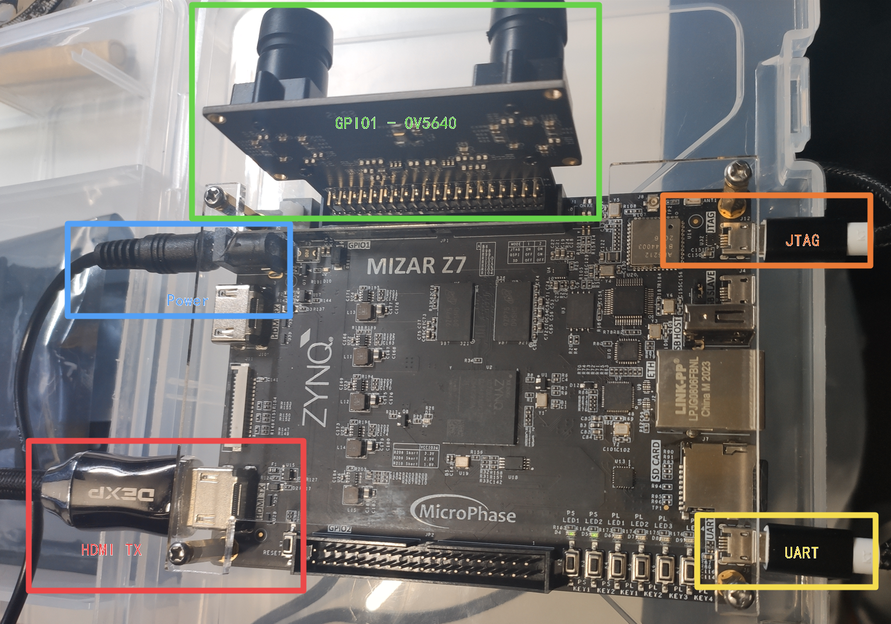

#### 2) 在 SDK 中写入 Bitstream 后开始运行

可以观察到成功的对检测到了角点，并且进行了标注

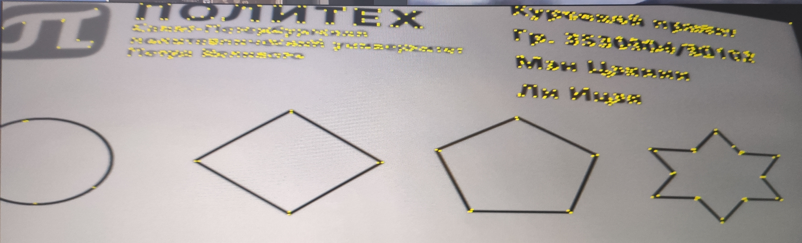


## 引用

[Xilinx xp1167 Accelerating OpenCV Applications with Zynq-7000 All Programmable SoC using Vivado HLS Video Libraries](https://www.xilinx.com/support/documentation/application_notes/xapp1167.pdf)

[Xilinx UG902 Vivado Design Suite User Guide High-Level Synthesis](https://china.xilinx.com/support/documentation/sw_manuals/xilinx2020_1/c_ug902-vivado-high-level-synthesis.pdf)

[Datasheet OV5640](https://cdn.sparkfun.com/datasheets/Sensors/LightImaging/OV5640_datasheet.pdf)

[MIZAR Z7 Circuit Schematic]()

[Dcam 5M OV5640 Circuit Schematic]()


