<!-- SPbSTU  -->

<h1 align="center"></h1>
 <p align="center">
  </br>
  <b><b>Санкт-Петербургский государственный политехнический университет</b></br></b>
  <b>Институт компьютерных наук и технологий</b>
  <h1 align="center"></h1>
 </p>
 <p align="center"></p>

</p>

<p align="center">
 <h1 align="center">Отчёт по курсовой работе</h1>
 <h2 align="center">по дисциплине «Микропроцессорные системы»</h2>
 <h2 align="center">Обнаружение углов на ZYNQ</h2>
</p>


<div align=center>


[](LICENSE)


<p align="center">
    <a href="../README.md">简体中文</a>
</p>

<div align=left>


[toc]


## Команда и преподаватель

- **Команда**

    - Мэн Цзянин, группа 3530904/90102
    - Ли Ицзя, группа 3530904/90102

    

- **Преподаватель**

    - Круглов С.К.


## GitHub Repository

Ссылки на репозитории GitHub: 

https://github.com/NekoSilverFox/CornerDetectionOnZYNQ


## Цель проекта

Реализация получения данных изображения в реальном времени камерой OV5640. Отметить положение угловой точки с помощью платы ZYNQ-7. Выводить обработанное изображение в экран через HDMI.


## Аппаратная платформа

- Плата：Mizar Z7
- Процессор：Zynq-7 XC7Z020clg400-2
- Камера：OV5640
- Экран：Xiaomi 34''


---


### Mizar Z7

#### MIZAR Z7 TOP Расположение поверхности


#### Принципиальная схема


#### PS Bank 500 & 501


#### PL Bank 34 & 35

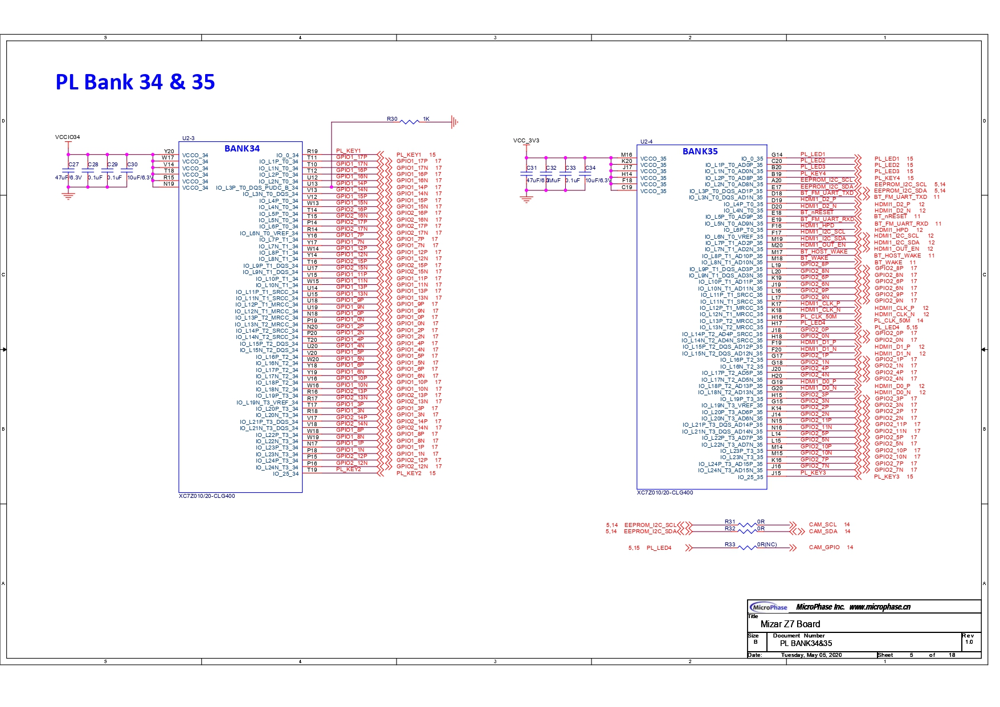

#### PL HDMI-TX


#### PL HDMI-RX

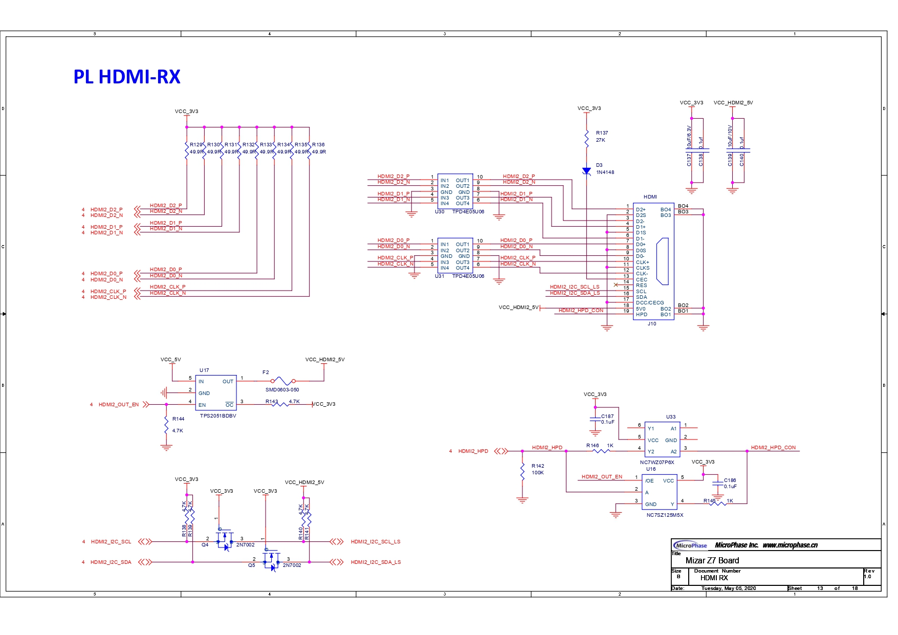


---

### OV5640

#### Введение

OV5640 - это 1/4-дюймовый однокристальный датчик изображения с матрицей 2592*1944 (т.е. 500 Вт пикселей), обеспечивающий захват изображения с разрешением до 15 кадров в секунду QSXVGA (2592*1944) или 90 кадров в секунду VGA (640*480). В датчике используется технология OmniBSI (Back Side Illumination) компании OmniVision для достижения более высоких характеристик, таких как высокая чувствительность, низкий уровень перекрестных помех и низкий уровень шума. Функции обработки изображений встроены в датчик, включая автоматическое управление экспозицией (AEC), автоматический баланс белого (AWB) и другие. Датчик также поддерживает светодиодную подсветку, выходные интерфейсы MIPI (Mobile Industrial Processor Interface) и DVP (Digital Video Parallel), ISP (Image Signal Processing) и AFC (Automatic Focus Control).

---

#### Функциональная блок-схема OV5640


Читая техническое описание, мы видим, что общий рабочий процесс OV5640 заключается в том, что в ядре датчика получения изображения, посредством экспозиции и выборки, необработанные данные аналогового изображения получаются в массиве изображений, графика увеличивается и корректируется AMP, затем скорректированное изображение преобразуется в битовый цифровой сигнал 10-битным чипом АЦП, а после блок изображения Процессор датчика изображения способен получать цифровой сигнал изображения, кэшировать его в интерфейс вывода изображения и, наконец, выводить 10-битный поток данных через интерфейс DVP или MP.

Как видно из приведенного выше графика:

- Генератор **временной синхронизации** управляет **массивом изображений**, **AMP**, **AD-преобразованием** и выводом **внешних сигналов синхронизации (VSYNC, HREF и PCLK)**, **внешним тактовым генератором XVCLK** после **PLL-фазовой петли**. Выходной тактовый генератор используется в качестве управляющего тактового генератора для системы
- Массив **изображений** преобразует оптический сигнал в аналоговый, который проходит через **усилитель усиления** и затем в 10-битный АЦП.
- Конвертер **AD** преобразует аналоговый сигнал в цифровой, который затем обрабатывается ISP (Image Signal Processing) для получения 10-битного видеопотока в настроенном формате.

Управление усилителем мощности и ISP может быть настроено через регистры**, а конфигурирование регистров осуществляется извне через шину SCCB**.

---

#### Интерфейсная шина SCCB

SCCB (Serial Camera Control Bus) - это трехпроводная последовательная шина, определенная и разработанная компанией OV (сокращение от OmniVision)**, которая управляет большинством функций камеры, включая формат данных изображения, разрешение и параметры обработки изображения**. Чтобы уменьшить количество контактов датчика, в большинстве шин SCCB теперь используется двухпроводная интерфейсная шина.

**В OV5640 используется двухпроводная интерфейсная шина SCCB с 16 битами (два байта) для адресов регистров. **

**Протокол передачи данных для СККБ OV5640 показан на следующей схеме:**

Из множества регистров OV5640 некоторые являются перезаписываемыми, а некоторые - только для чтения, и только в перезаписываемые регистры можно производить корректную запись.


- `ID ADDRESS` - 7-битный адрес устройства и 1-битный бит управления чтением/записью (0:запись 1:чтение), адрес устройства OV5640 - 7'h3c, поэтому в протоколе передачи **запись**, ID Address(W) = 8'h78 (адрес устройства сдвинут на 1 бит влево, младший бит дополнен 0).
- `Sub-address(H)` - старший 8-битный адрес регистра
- `Sub-address(L)` - младший 8-битный адрес регистра
- `Write Data` - 8-битные данные записи, каждый адрес регистра соответствует 8 битам данных конфигурации

---

#### Включение и сброс питания

Для нормальной работы OV5640 необходимо выполнить определенные требования к включению питания


- t0: >= 0 мс: время между стабилизацией DOVDD и стабилизацией AVDD
- t2: >= 5 мс: время между стабилизацией AVDD и стабилизацией включения датчика
- t3: >= 1 мс: задержка между стабилизацией питания датчика и подтягиванием ResetB
- t4: >= 20 мс: задержка между подтягиванием высокого уровня ResetB и инициализацией SCCB

**Шаги:**

ResetB подтянут к низкому уровню, сброс OV5640.
2. Подайте питание на DOVDD и AVDD, желательно на оба одновременно
3. Дождитесь стабилизации AVDD в течение 5 мс, затем переведите PWDN в низкий уровень 4. 
4. после того, как PWDN находится в низком состоянии в течение 1 мс, подтяните ResetB
5. через 20 мс инициализируйте настройки регистра SCCB в OV5640


---


## Программная платформа

- Vivado v2018.3
- Xilinx SDK v2018.3
- Vivado HLS v2018.3


## Протоколы последовательной связи

### UART

#### Введе

**Универсальный асинхронный приёмопередатчик** (УАПП, [англ.](https://ru.wikipedia.org/wiki/Английский_язык) *Universal Asynchronous Receiver-Transmitter, UART*) — узел вычислительных устройств, предназначенный для организации связи с другими цифровыми устройствами. Преобразует передаваемые данные в последовательный вид так, чтобы было возможно передать их по одной физической цифровой линии другому аналогичному устройству. Метод преобразования хорошо стандартизован и широко применяется в компьютерной технике (особенно во [встраиваемых устройствах](https://ru.wikipedia.org/wiki/Встраиваемая_система) и [системах на кристалле (SoC)](https://ru.wikipedia.org/wiki/Система_на_кристалле)).

Представляет собой логическую схему, с одной стороны подключённую к шине вычислительного устройства, а с другой имеющую два или более выводов для внешнего соединения.

UART может представлять собой отдельную микросхему (например, Intel I8251, I8250) или являться частью [большой интегральной схемы](https://ru.wikipedia.org/wiki/Интегральная_схема) (например, [микроконтроллера](https://ru.wikipedia.org/wiki/Микроконтроллер)). Используется для передачи данных через [последовательный порт](https://ru.wikipedia.org/wiki/Последовательный_порт) [компьютера](https://ru.wikipedia.org/wiki/Компьютер).

#### Метод передачи и приёма

Передача данных в UART осуществляется по одному [биту](https://ru.wikipedia.org/wiki/Бит) в равные промежутки времени. Этот временной промежуток определяется заданной **скоростью UART** и для конкретного соединения указывается в [бодах](https://ru.wikipedia.org/wiki/Бод) (что в данном случае соответствует битам в секунду). Существует общепринятый ряд стандартных скоростей: 300; 600; 1200; 2400; 4800; 9600; 19200; 38400; 57600; 115200; 230400; 460800; 921600 бод. Скорость (, бод) и длительность бита (, секунд) связаны соотношением . Скорость в бодах иногда называют [сленговым](https://ru.wikipedia.org/wiki/Сленг) словом *бодрейт* или *битрейт*.

Помимо информационных битов, UART автоматически вставляет в поток синхронизирующие метки, так называемые **стартовый и стоповый биты**. При приёме эти лишние биты удаляются из потока. Обычно стартовый и стоповый биты обрамляют один байт информации (8 бит), при этом младший информационный бит передаётся первым, сразу после стартового. Встречаются реализации UART, передающие по 5, 6, 7 или 9 информационных бит. Обрамлённые стартом и стопом биты являются минимальной посылкой. Некоторые реализации UART используют два стоповых бита при передаче для уменьшения вероятности рассинхронизации приёмника и передатчика при плотном трафике. Приёмник игнорирует второй стоповый бит, воспринимая его как короткую паузу на линии.

Принято соглашение, что пассивным (в отсутствие потока данных) состоянием входа и выхода UART является логическая 1. Стартовый бит всегда является логическим 0, поэтому приёмник UART ждёт перепада из 1 в 0 и отсчитывает от него временной промежуток в половину длительности бита (середина передачи стартового бита). Если в этот момент на входе всё ещё 0, то запускается процесс приёма минимальной посылки. Для этого приёмник отсчитывает 9 битовых длительностей подряд (для 8-битных данных), и в каждый момент фиксирует состояние входа. Первые 8 значений являются принятыми данными, последнее значение проверочное (стоп-бит). Значение стоп-бита всегда равно 1. Если реально принятое значение иное, UART фиксирует ошибку.

Для формирования временных интервалов передающий и приёмный UART имеют **источник точного времени** (тактирования). Точность этого источника должна быть такой, чтобы сумма погрешностей (приёмника и передатчика) установки временного интервала от начала стартового импульса до середины стопового импульса не превышала половины (а лучше четверти) битового интервала[[1\]](https://ru.wikipedia.org/wiki/Универсальный_асинхронный_приёмопередатчик#cite_note-1). Для 8-битной посылки это значение 0,5/9,5 ≈ 5 %. На практике, с учётом возможных искажений сигнала в линии, общая ошибка тактирования должна быть не более 3 %. Поскольку в худшем случае ошибки тактов приёмника и передатчика могут суммироваться, то рекомендуемый допуск на точность тактирования UART — не более 1,5 %.

Поскольку синхронизирующие биты занимают часть битового потока, то результирующая **пропускная способность** UART меньше скорости соединения. Например, для 8-битных посылок формата [8-N-1](https://ru.wikipedia.org/wiki/Универсальный_асинхронный_приёмопередатчик#Короткая_запись_параметров) синхронизирующие биты занимают 20 % потока, что при физической скорости линии 115 200 [бод](https://ru.wikipedia.org/wiki/Бод) означает полезную скорость передачи данных 92 160 [бит/с](https://ru.wikipedia.org/wiki/Бит_в_секунду) или 11 520 байт/с.


[](https://commons.wikimedia.org/wiki/File:Puerto_serie_Rs232-ru.svg)


### I²C

#### Введе

**I²C** (**IIC)**, [рус.](https://ru.wikipedia.org/wiki/Русский_язык) *ай-квадрат-си* или *ай-ту-си*, [англ.](https://ru.wikipedia.org/wiki/Английский_язык) *Inter-Integrated Circuit*) — [последовательная](https://ru.wikipedia.org/wiki/Последовательная_передача_данных) асимметричная [шина](https://ru.wikipedia.org/wiki/Шина_(компьютер)) для связи между [интегральными схемами](https://ru.wikipedia.org/wiki/Интегральная_схема) внутри [электронных приборов](https://ru.wikipedia.org/wiki/Электронное_устройство). Использует две двунаправленные линии связи (SDA и SCL), применяется для соединения низкоскоростных [периферийных компонентов](https://ru.wikipedia.org/wiki/Периферийное_устройство) с [процессорами](https://ru.wikipedia.org/wiki/Процессор) и [микроконтроллерами](https://ru.wikipedia.org/wiki/Микроконтроллер) (например, на [материнских платах](https://ru.wikipedia.org/wiki/Материнская_плата), во [встраиваемых системах](https://ru.wikipedia.org/wiki/Встраиваемая_система), в [мобильных телефонах](https://ru.wikipedia.org/wiki/Мобильный_телефон)).


#### Принцип подключения

Шина I2C синхронная, состоит из двух линий: данных (SDA) и тактов (SCL). Есть ведущий (master) и ведомые (slave). Инициатором обмена всегда выступает ведущий, обмен между двумя ведомыми невозможен. Всего на одной двухпроводной шине может быть до 127 устройств.

Такты на линии SCL генерирует master. Линией SDA могут управлять как мастер, так и ведомый в зависимости от направления передачи. Единицей обмена информации является пакет, обрамленный уникальными условиями на шине, именуемыми стартовым и стоповым условиями. Мастер в начале каждого пакета передает один байт, где указывает адрес ведомого и направление передачи последующих данных. Данные передаются 8-битными словами. После каждого слова передается один бит подтверждения приема приемной стороной.


#### Принцип работы

[](https://commons.wikimedia.org/wiki/File:I2C_data_transfer.svg)

Тактировка последовательности передачи данных

I²C использует две двунаправленные линии, подтянутые к напряжению питания и управляемые через открытый коллектор или открытый сток — последовательная линия данных (SDA, [англ.](https://ru.wikipedia.org/wiki/Английский_язык) *Serial DAta*) и последовательная линия [тактирования](https://ru.wikipedia.org/wiki/Тактирование) (SCL, [англ.](https://ru.wikipedia.org/wiki/Английский_язык) *Serial CLock*). Стандартные напряжения +5 В или +3,3 В, однако допускаются и другие.

Классическая [адресация](https://ru.wikipedia.org/wiki/Адрес_(информатика)) включает 7-битное [адресное пространство](https://ru.wikipedia.org/wiki/Адресное_пространство) с 16 зарезервированными адресами. Это означает, что разработчикам доступно до 112 свободных адресов для подключения периферии на одну шину.

Основной режим работы — 100 кбит/с; 10 кбит/с в режиме работы с пониженной скоростью. Также немаловажно, что стандарт допускает приостановку тактирования для работы с медленными устройствами.

#### Процесс передачи посылки. Состояние СТАРТ и СТОП

Процедура обмена начинается с того, что ведущий формирует **состояние СТАРТ**: при ВЫСОКОМ уровне на линии SCL он генерирует переход сигнала линии SDA из ВЫСОКОГО состояния в НИЗКОЕ. Этот переход воспринимается всеми устройствами, подключенными к шине, как признак начала процедуры обмена. Генерация синхросигнала — это всегда обязанность ведущего; каждый ведущий генерирует свой собственный сигнал синхронизации при пересылке данных по шине.


При передаче посылок по шине I²C каждый ведущий генерирует свой синхросигнал на линии SCL. После формирования состояния СТАРТ ведущий опускает состояние линии SCL в НИЗКОЕ состояние и выставляет на линию SDA старший бит первого байта сообщения. Количество байт в сообщении не ограничено. Спецификация шины I²C разрешает изменения на линии SDA только при НИЗКОМ уровне сигнала на линии SCL. Данные действительны и должны оставаться стабильными только во время ВЫСОКОГО состояния синхроимпульса. Для подтверждения приёма байта от ведущего-передатчика ведомым-приёмником в спецификации протокола обмена по шине I²C вводится специальный бит подтверждения, выставляемый на шину SDA после приёма 8 бит данных.


Процедура обмена завершается тем, что ведущий формирует **состояние СТОП** — переход состояния линии SDA из НИЗКОГО состояния в ВЫСОКОЕ при ВЫСОКОМ состоянии линии SCL. Состояния СТАРТ и СТОП всегда вырабатываются ведущим. Считается, что шина занята после фиксации состояния СТАРТ. Шина считается освободившейся через некоторое время после фиксации состояния СТОП.

#### Подтверждение

Таким образом, передача 8 бит данных от передатчика к приёмнику завершаются дополнительным циклом (формированием 9-го тактового импульса линии SCL), при котором приёмник выставляет низкий уровень сигнала на линии SDA, как признак успешного приёма байта.

Подтверждение при передаче данных обязательно, кроме случаев окончания передачи ведомой стороной. Соответствующий импульс синхронизации генерируется ведущим. Передатчик отпускает (переводит в ВЫСОКОЕ состояние) линию SDA на время синхроимпульса подтверждения. Приёмник должен удерживать линию SDA в течение ВЫСОКОГО состояния синхроимпульса подтверждения в стабильном НИЗКОМ состоянии.

В том случае, когда ведомый-приёмник не может подтвердить свой адрес (например, когда он выполняет в данный момент какие-либо функции реального времени), линия данных должна быть оставлена в ВЫСОКОМ состоянии. После этого ведущий может выдать состояние СТОП для прерывания пересылки данных. Если в пересылке участвует ведущий-приёмник, то он должен сообщить об окончании передачи ведомому-передатчику путём неподтверждения последнего байта. Ведомый-передатчик должен освободить линию данных для того, чтобы позволить ведущему выдать состояние СТОП или повторить состояние СТАРТ.

#### Синхронизация

Синхронизация выполняется с использованием подключения к линии SCL по правилу монтажного И. Это означает, что ведущий не имеет монопольного права на управление переходом линии SCL из НИЗКОГО состояния в ВЫСОКОЕ. В том случае, когда ведомому необходимо дополнительное время на обработку принятого бита, он имеет возможность удерживать линию SCL в низком состоянии до момента готовности к приёму следующего бита. Таким образом, линия SCL будет находиться в НИЗКОМ состоянии на протяжении самого длинного НИЗКОГО периода синхросигналов.

Устройства с более коротким НИЗКИМ периодом будут входить в состояние ожидания на время, пока не кончится длинный период. Когда у всех задействованных устройств кончится НИЗКИЙ период синхросигнала, линия SCL перейдет в ВЫСОКОЕ состояние. Все устройства начнут проходить ВЫСОКИЙ период своих синхросигналов. Первое устройство, у которого кончится этот период, снова установит линию SCL в НИЗКОЕ состояние. Таким образом, НИЗКИЙ период синхролинии SCL определяется наидлиннейшим периодом синхронизации из всех задействованных устройств, а ВЫСОКИЙ период определяется самым коротким периодом синхронизации устройств.

Механизм синхронизации может быть использован приёмниками как средство управления пересылкой данных на байтовом и битовом уровнях.

На уровне байта, если устройство может принимать байты данных с большой скоростью, но требует определенное время для сохранения принятого байта или подготовки к приёму следующего, то оно может удерживать линию SCL в НИЗКОМ состоянии после приёма и подтверждения байта, переводя таким образом передатчик в состояние ожидания.

На уровне битов устройство, такое, как микроконтроллер без встроенных аппаратных цепей I²C или с ограниченными цепями, может замедлить частоту синхроимпульсов путём продления их НИЗКОГО периода. Таким образом скорость передачи любого ведущего адаптируется к скорости медленного устройства.

#### Адресация в шине I²C

Каждое устройство, подключённое к шине, может быть программно адресовано по уникальному адресу. Для выбора приёмника сообщения ведущий использует уникальную адресную компоненту в формате посылки. При использовании однотипных устройств ИС часто имеют дополнительный селектор адреса, который может быть реализован как в виде дополнительных цифровых входов селектора адреса, так и в виде аналогового входа. При этом адреса таких однотипных устройств оказываются разнесены в адресном пространстве устройств, подключенных к шине.

В обычном режиме используется 7-битная адресация.

Процедура адресации на шине I²C заключается в том, что первый байт после сигнала СТАРТ определяет, какой ведомый адресуется ведущим для проведения цикла обмена. Исключение составляет адрес «Общего вызова», который адресует все устройства на шине. Когда используется этот адрес, все устройства в теории должны послать сигнал подтверждения. Однако устройства, которые могут обрабатывать «общий вызов», на практике встречаются редко.

Первые семь битов первых двух байтов образуют адрес ведомого. Восьмой, младший бит, определяет направление пересылки данных. «Ноль» означает, что ведущий будет передавать информацию выбранному ведомому. «Единица» означает, что ведущий будет получать информацию от ведомого.

После того, как адрес послан, каждое устройство в системе сравнивает первые семь бит после сигнала СТАРТ со своим адресом. При совпадении устройство полагает себя выбранным как ведомый-приёмник или как ведомый-передатчик, в зависимости от бита направления.

Адрес ведомого может состоять из фиксированной и программируемой части. Часто случается, что в системе имеется несколько однотипных устройств (к примеру, ИМС памяти, или [драйверов](https://ru.wikipedia.org/wiki/Драйвер_(электроника)) светодиодных [индикаторов](https://ru.wikipedia.org/wiki/Электронный_индикатор)), поэтому при помощи программируемой части адреса становится возможным подключить к шине максимально возможное количество таких устройств. Количество программируемых битов в адресе зависит от количества свободных выводов микросхемы. Иногда используется один вывод с аналоговой установкой программируемого диапазона адресов[[2\]](https://ru.wikipedia.org/wiki/I²C#cite_note-2). При этом в зависимости от потенциала на этом адресном выводе ИМС, возможно смещение адресного пространства драйвера так, чтобы однотипные ИМС не конфликтовали между собой на общей шине.

Все специализированные ИМС, поддерживающие работу в стандарте шины I²C, имеют набор фиксированных адресов, перечень которых указан производителем в описаниях контроллеров.

Комбинация бит 11110ХХ адреса зарезервирована для 10-битной адресации.

Как следует из спецификации шины, допускаются как простые форматы обмена, так и комбинированные, когда в промежутке от состояния СТАРТ до состояния СТОП ведущий и ведомый могут выступать и как приёмник, и как передатчик данных. Комбинированные форматы могут быть использованы, например, для управления последовательной памятью.

Во время первого байта данных можно передавать адрес в памяти, который записывается во внутренний [регистр-защёлку](https://ru.wikipedia.org/wiki/Регистр_(цифровая_техника)). После повторения сигнала СТАРТа и адреса ведомого выдаются данные из памяти. Все решения об авто-инкременте или декременте адреса, к которому произошёл предыдущий доступ, принимаются конструктором конкретного устройства. Поэтому в любом случае лучший способ избежать неконтролируемой ситуации на шине перед использованием новой (или ранее не используемой) ИМС — следует тщательно изучить паспорт изделия или справочное руководство.

В любом случае по спецификации шины все разрабатываемые устройства должны сбрасывать логику шины при получении сигнала СТАРТ или повторный СТАРТ и подготавливаться к приёму адреса.

Тем не менее, основные проблемы с использованием I²C шины возникают именно из-за того, что разработчики, «начинающие» работать с I²C шиной, не учитывают того факта, что ведущий (часто — микропроцессор) не имеет монопольного права ни на одну из линий шины.


## Введение в экспериментальный процесс

Процесс можно делить на 4 части:

1. Разработка с HLS 
2. Дизайн с Vivado
3. Программирование с Xilinx SDK 
4. Проверка на плате

### Блок-схема системной архитектуры

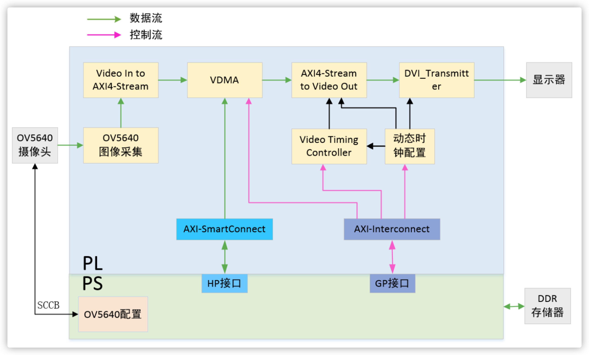


## Процесс

### 1. Разработка с HLS 

#### 1) Новое строительство и конфигурация

1. Открыть Vivado HLS v2018.3 , выбрать `Create New Project`

   

2. Щёлкать `Next`，на `Solution Configuration` выбрать `xc7z020clg400-2`

   


#### 2) Импортировать файл тестового изображения и следующий код

1. импортируйте файл тестового изображения и следующий код в `Source`.

   - CornerDetect.h

     ```C++
     #ifndef __CORNER_HEAD_H_
     #define __CORNER_HEAD_H_
     
     #include "hls_video.h"
     #include "ap_axi_sdata.h"
     
     //размер изображения
     #define WIDTH 1024
     #define HEIGHT 768
     
     //Входные и выходные изображения
     #define SRC_IMAGE "screen.bmp"		//Входное изображение
     #define DST_IMAGE "DstImage.bmp"	//Выходное изображение
     #define GOLD_IMAGE "GoldImage.bmp"	//Путь к эталонному изображению
     
     //Типы данных изображения
     
     //AXI-Stream bitstream
     typedef ap_axiu<24,1,1,1> int_sideChannel;
     typedef hls::stream<ap_axiu<24,1,1,1> > AXI_STREAM ;
     
     //Матрица изображения, где формат пикселей в матрице изображения 3-канальное 8-битное беззнаковое число, изображение RGB
     typedef hls::Mat<HEIGHT,WIDTH,HLS_8UC3> IMAGE_RGB;
     
     //Формат каждого пикселя матрицы изображения, 3-канальный 8-битный беззнаковый тип
     typedef hls::Scalar<3,unsigned char> PIXEL_RGB;
     
     //Матрица изображения, формат пикселей в матрице изображения - 1-канальное 8-битное беззнаковое число, изображение в градациях серого
     typedef hls::Mat<HEIGHT,WIDTH,HLS_8UC1> IMAGE_GRAY;
     
     //Формат каждого пикселя матрицы изображения, 1-канальный 8-битный беззнаковый тип
     typedef hls::Scalar<1,unsigned char> PIXEL_GRAY;
     
     
     //top function
     void rgb2gray(IMAGE_RGB & imgIn, IMAGE_RGB & imgOut_3C, IMAGE_GRAY & imgOut_1C);
     void doCorner(AXI_STREAM & inStream,AXI_STREAM & outStream);
     #endif
     ```

   - CornerDetect.cpp

     ```C++
     #include "CornerDetect.h"
     
     void rgb2gray(IMAGE_RGB & imgIn, IMAGE_RGB & imgOut_3C, IMAGE_GRAY & imgOut_1C){
     	PIXEL_RGB 	pixIn;
     	PIXEL_RGB 	pixOut_3C;
     	PIXEL_GRAY	pixOut_1C;
     
     	for(int idxRow = 0; idxRow < HEIGHT; idxRow++){
     		for(int idxCol = 0; idxCol < WIDTH; idxCol++){
     			//Входное изображение - трехканальное изображение RGB.
     			imgIn >> pixIn;
     			unsigned short R = pixIn.val[0];
     			unsigned short G = pixIn.val[1];
     			unsigned short B = pixIn.val[2];
     
     			//Выводит трехканальное изображение, каждый канал имеет значение серого, а конечное отображаемое изображение - изображение в градациях серого.
     			pixOut_3C.val[0] = (unsigned char) ((R*76 + G*150 + B*30) >> 8);
     			pixOut_3C.val[1] = (unsigned char) ((R*76 + G*150 + B*30) >> 8);
     			pixOut_3C.val[2] = (unsigned char) ((R*76 + G*150 + B*30) >> 8);
     
     			//Вывод одноканального изображения, только с одним каналом, который является изображением в градациях серого.
     			pixOut_1C.val[0] = (unsigned char) ((R*76 + G*150 + B*30) >> 8);
     			imgOut_3C << pixOut_3C;
     			imgOut_1C << pixOut_1C;
     		}
     	}
     }
     
     void doCorner(AXI_STREAM & inStream,AXI_STREAM & outStream){
     #pragma HLS INTERFACE axis  port=outStream
     #pragma HLS INTERFACE axis  port=inStream
     #pragma HLS INTERFACE s_axilite port=return bundle=CTRL_BUS
     
     
     	IMAGE_RGB img_0;
     	IMAGE_RGB img_1;
     	IMAGE_GRAY img_2;
     	IMAGE_RGB img_3;
     	IMAGE_GRAY mask;
     	IMAGE_GRAY dmask;
     
     #pragma HLS dataflow
     #pragma HLS stream depth=20000 variable=img_1_.data_stream
     	hls::AXIvideo2Mat(inStream, img_0);
     	PIXEL_RGB color(255,255,0);
     	rgb2gray(img_0, img_1, img_2);
     	hls::FASTX(img_2, mask, 20, true);			// Быстрое обнаружение стопы
     	hls::Dilate(mask, dmask);					// Развернить обнаруженные точки
     	hls::PaintMask(img_1, dmask, img_3, color);		//Добавить надутую точку к изображению
     	hls::Mat2AXIvideo(img_3, outStream);
     }
     ```

4. на `Test Bench` импортировать следующий тестовый файл

   ```C++
   #include <stdio.h>
   #include <opencv2/opencv.hpp>
   #include "CornerDetect.h"
   #include "hls_opencv.h"
   using namespace cv ;
   
   
   //Сравнение изображений
   int image_compare(const char* output_image, const char* golden_image) {
       if (!(output_image) || !(golden_image)) {
           printf("Failed to open images...exiting.\n");
           return -1;
       } else {
           Mat o = imread(output_image);
           Mat g = imread(golden_image);
           assert(o.rows == g.rows && o.cols == g.cols);	//assert Если это правильно, запускать следующую программу, в противном случае сообщить об ошибке.
           assert(o.channels() == g.channels() && o.depth() == g.depth());
           printf("rows = %d, cols = %d, channels = %d, depth = %d\n", o.rows, o.cols, o.channels(), o.depth());
           int flag = 0;
           for (int i = 0; i < o.rows && flag == 0; i++) {
               for (int j = 0; j < o.cols && flag == 0; j++) {
                   for (int k = 0; k < o.channels(); k++) {
                       unsigned char p_o = (unsigned char)*(o.data + o.step[0]*i + o.step[1]*j + k);
                       unsigned char p_g = (unsigned char)*(g.data + g.step[0]*i + g.step[1]*j + k);
                       if (p_o != p_g) {
                           printf("First mismatch found at row = %d, col = %d\n", i, j);
                           printf("(channel%2d) output:%5d, golden:%5d\n", k, p_o, p_g);
                           flag = 1;
                           break;
                       }
                   }
               }
           }
           if (flag)
               printf("Test Failed!\n");
           else
               printf("Test Passed!\n");
   
           return flag;
       }
   }
   
   int main(){
   	IplImage * SrcImage;				//Входное изображение
   	IplImage * DstImage;				//Выходное изображение
   	SrcImage = cvLoadImage(SRC_IMAGE,-1);//Импортировать изображение
   
   	//Создать выходной образ, поддерживаемый opencv
   	DstImage = cvCreateImage(cvGetSize(SrcImage),SrcImage->depth, SrcImage->nChannels);
   	//AXI-Stream bitstream
   	AXI_STREAM inStream;
   	AXI_STREAM outStream;
   
   	IplImage2AXIvideo(SrcImage,inStream);
   
   	//Синтезируемая функция
   	doCorner(inStream, outStream);
   	//Сохронить выходный результат
   	AXIvideo2IplImage(outStream,DstImage);
   	cvSaveImage(DST_IMAGE,DstImage);
   
   	//Вывод эталонного изображения
   	cvShowImage(DST_IMAGE, DstImage);
   	cvWaitKey(0);
   
   
   	//Освобождение изоброжений
   	cvReleaseImage(&SrcImage);
   	cvReleaseImage(&DstImage);
   	return 0;
   }
   ```


#### 3) Синтез и моделирование

1. Убедившись в правильности кода, выполните последовательность действий

   1. Run C Simulatoin（симуляция）
   2. Run C Synthesis（Синтез）
   3. Run C/RTL Cosimulation（Косимуляция）
   4. Export RTL
       

   Мы получим нужный IP для обработки изображений
   
   

---


### 2. Дизайн на Vivado

#### 1) Создать новый Vivado прект

Новый проект Vivado, Soc выберите `xc7z020clg400-2`.


#### 2) Импортировать настраиваемое IP-ядро

Как показано на картинке:   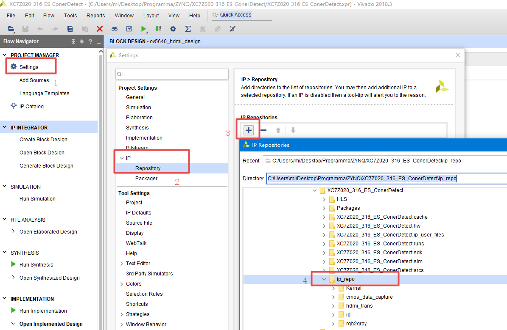


#### 3) Добавить`ZYNQ-7` IP

   - Разрешить порт UART 

   - Напряжение Bank 1 установится как 1.8V

     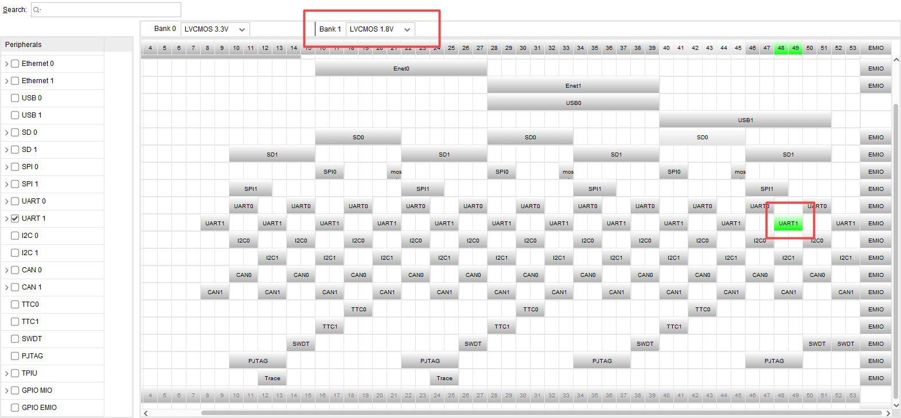

   - Вывеодить соответствующий штифт

     Конфигурация выполнилась, как показано на рисунке ниже:

     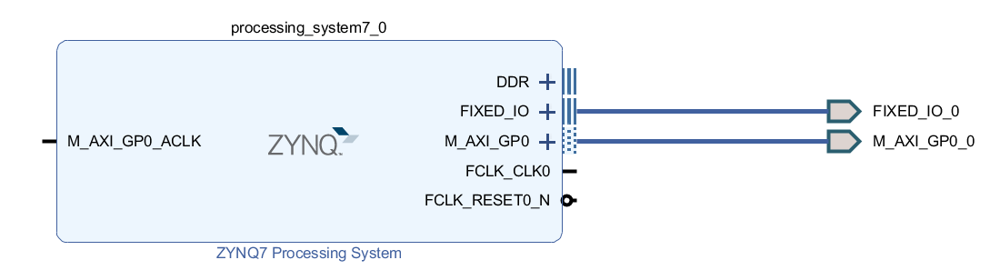
     


#### 4) Измените модель памяти в соответствии с моделью платы разработки


#### 5) Добавить IP ядро камеры OV5640

**Описание сигналов:**

| Название сигнала | Направление | Описание порта |
| ------------------ | ------ | ------------------------ |
| clk | input | clock |
| rst | вход | сигнал сброса |
| cmos_cfg_done | input | register_configuration_complete_signal |
| cmos_pclk | вход | пиксельный тактовый генератор данных cmos | пиксельный тактовый генератор данных cmos.
| cmos_vsync | вход | сигнал синхронизации поля cmos |
| cmos_href | вход | сигнал синхронизации линии cmos |
| cmos_data[9:0] | вход | cmos-данные
| pclk | output | pixel out clock | пиксельный выходной генератор.
| cmos_data_vld | output | флаг активного кадра |
| cmos_clk_en | выход | разрешение тактового генератора cmos siagnl | |
| capture_data[23:0] | выход |
| vsync | output | | |

**Конфигурация:**

Выводить сигнал порта, подключенный к внешнему контакту, и изменить названия сигнала, чтобы облегчить идентификацию и ограничения контактов. Сигнал, который нужно нарисовать, показан на рисунке ниже:

   

   Использовать выходные часы ПК в качестве тактовых импульсов привода IP и подключите тактовый сигнал, как показано на рисунке ниже.：

   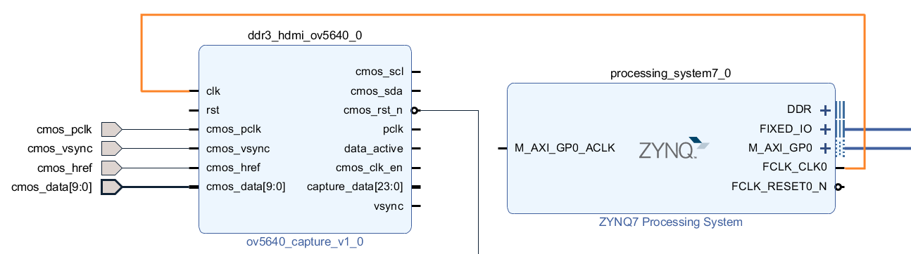


#### 6) Добавить видео в IP ядро AXI4-Stream (контроллер вывода видео)

**Введение ядра IP:**

 IP-ядро Video In to AXI4-Stream используется для преобразования видеоисточников (тактируемых параллельных видеоданных с синхронными сигналами, т.е. синхронной синхронизации или затухающих пустых сигналов или обоих последних) в форму интерфейса AXI4-Stream, что позволяет преобразовать интерфейс. ИС также может использовать ядро VTC, которое действует как мост между видеовходом и обработкой видео.

**Конфигурация:**

   Установить режим часов в независимый режим (Independent)


   И подключить сигнал камеры OV5640 следующим образом

   


#### 7) Добавить IP-ядро Clocking Wizard

**Введение ядра IP:**

Обеспечивает тактовые сигналы, соответствующие частоте

**Конфигурация:**

   Установить входную тактовую частоту на 50 МГц, установить выходную частоту тактовых импульсов 1 на 65 МГц, установить частоту тактовых импульсов 2 на 325 МГц и установить для сигнала сброса низкий активный уровень.

   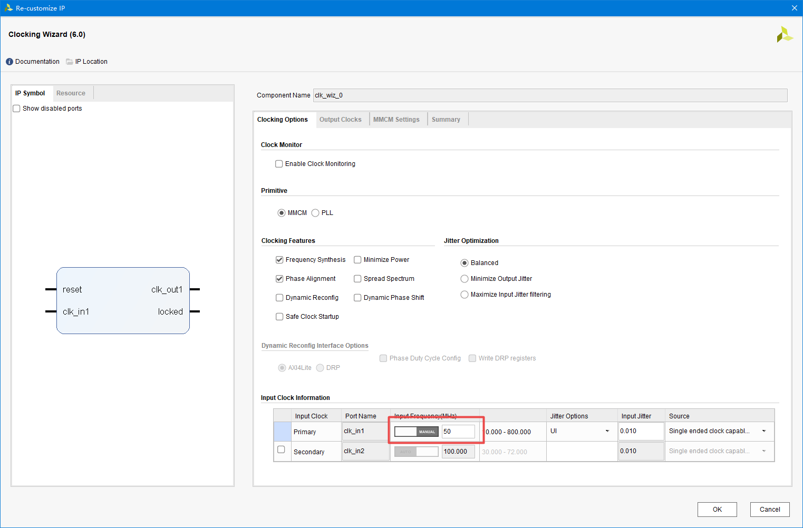

   


#### 8) Добавить IP логической схемы логического элемента Vector Logic

**Введение в IP-ядра:**.

Простая схема логического затвора

**Конфигурация:**

Установить схему затвора на 1 бит и инвертируйте ее.


После настройки подключите соответствующие сигналы.

- Тактовый сигнал clk_in1 ИС тактового генератора подключается к выходному тактовому генератору на стороне ps, а сигнал сброса подключается к выходному сигналу сброса на стороне ps.
- Тактовый вход clk микросхемы ov5640_capture подключен к выходному тактовому сигналу на стороне ps, сигнал сброса **high valid**, сигнал сброса на стороне ps подключен к входу инвертированного сигнала сброса после негейта.
- Тактовый сигнал aclk видеовхода в ИС AXI4-Stream подключается к выходному тактовому генератору на стороне ps. 

Подключение сигналов тактового генератора и сброса показано ниже:

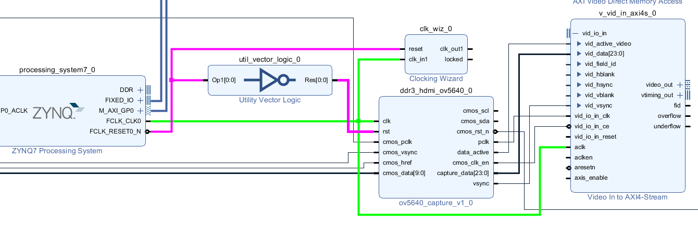


#### 9) Добавить два IP-адреса VDMA

> Используйте IP-ядро VDMA для реализации прямого хранения в памяти с высокой пропускной способностью или чтения для целевых периферийных устройств AXI4-Stream для чтения данных в DDR. После того, как VDMA считывает данные, он преобразует поток данных в поток данных видеопротокола через IP-ядро AXI4-Stream to Video Out.


**Введение в IP-ядро VDMA:** AXI VDMA (AXI Video Direct Memory Access) - это программное ядро IP, предоставляемое компанией Xilinx.

AXI VDMA (AXI Video Direct Memory Access, далее VDMA) - это программно-аппаратный комплекс, предоставляемый компанией Xilinx, который можно рассматривать как модернизацию DMA, обеспечивающую ряд функций, подходящих для приложений обработки видеоизображений. Подобно DMA, эта ИС обеспечивает прямые доступы к памяти с высокой пропускной способностью между памятью или целевыми периферийными устройствами класса AXI4-Stream. В ИС добавлены такие функции, как механизмы буферизации кадров и GenLock, а также интегрированы специфические для видео функции, такие как кадровая синхронизация и передача 2D DMA, что делает ее идеальной для приложений обработки изображений и видео на базе архитектуры ZYNQ.

AXI VDMA - это программная базовая ИС компании Xilinx для преобразования потоков данных в формате AXI Stream в формат Memory Map или данных в формате Memory Map в потоки данных AXI Stream для связи с DDR3.

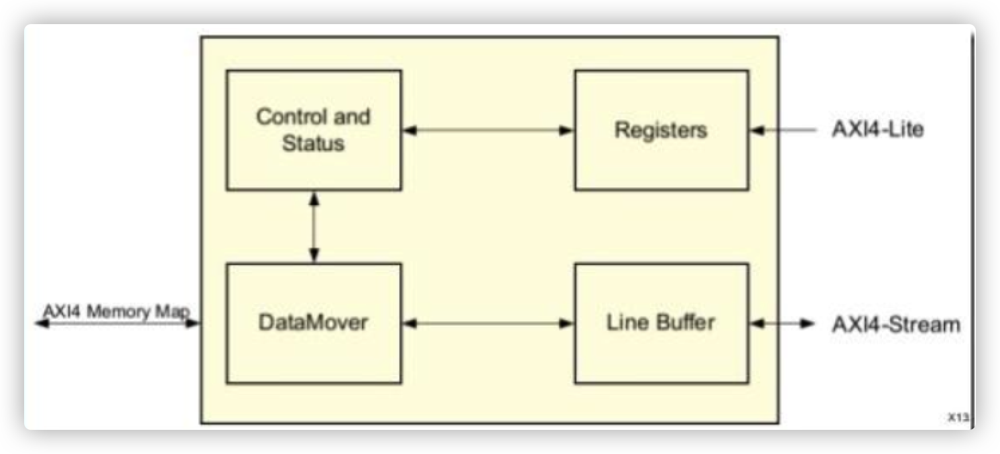

Доступны следующие основные типы интерфейсов.

- **AXI-lite: PS конфигурирует VDMA через этот интерфейс**.
- AXI Memory Map write: отображается на запись в память
- Чтение карты памяти AXI: чтение карты памяти
- **AXI Stream Write (S2MM): запись видеопотока AXI Stream в изображение**.
- **AXI Stream Read (MM2S): изображение для чтения видеопотока AXI Stream**.

Как видно из блок-схемы, VDMA состоит в основном из регистров управления и состояния, модуля обработки данных и линейного буфера. Данные, поступающие в DDR и покидающие ее, кэшируются в линейном буфере, а затем записываются или считываются модулем обработки данных. Модуль обработки данных управляется соответствующими регистрами, а рабочее состояние VDMA может быть получено путем чтения регистров состояния.


**Связанные понятия:**

- **Кадровый кэш**

    В повседневной жизни мы знаем, что для плавного воспроизведения видео требуется не менее 24 кадров в секунду, то есть 24 изображения в секунду. Как правило, в оборудовании для обработки изображений скорости передачи данных источника ввода изображения и дисплея изображения не совпадают (например, источник ввода изображения быстрее или дисплей изображения быстрее), поэтому очевидно, что считывать данные источника ввода непосредственно для отображения нецелесообразно. Это называется кадровым буфером, или кадровым кэшем, и часто называется видеопамятью. Каждая ячейка памяти в кадровом буфере соответствует одному пикселю на экране, а весь кадровый буфер соответствует одному кадру изображения.

    При использовании кадрового буфера для кэширования данных изображения может быть использована схема с одним или несколькими кадровыми буферами. Кэш **однокадровый - это кэш, в котором ввод и вывод изображения осуществляются путем чтения и записи в одну и ту же область хранения**. Кэш **многокадровый - это кэш, в котором разные изображения хранятся в разных областях памяти и последовательно считываются** при отображении. Очевидно, что однокадровый кэш имеет тот недостаток, что когда источник данных подается непрерывно, в кадровом кэше могут храниться два или более кадров данных изображения, наложенных друг на друга, что приводит к фрагментации изображения при считывании устройством отображения. Поэтому однокадровый кэш подходит для приложений, где скорость ввода ниже скорости чтения. **Кэширование нескольких кадров** требуется для отображения изображения с камеры или воспроизведения видео.

- **Синхронная фазовая блокировка**.

    На практике многокадровый кэш часто используется для хранения данных с целью устранения потенциальных ошибок, вызванных несоответствием между скоростями передачи данных на входе и выходе изображения. В то время как входное изображение записывается в один из кэшей кадров, выходное считывает другие кэши кадров. Это предполагает стратегию чтения/записи для кадрового кэша, т.е. синхронный режим фазовой блокировки.

    VDMA поддерживает четыре режима синхронной фазовой синхронизации: Genlock Maste, Genlock Slave, Dynamic Genlock Master и Dynamic Genlock Slave.

    ** VDMA имеет канал записи (S2MM) и канал чтения (MM2S), по которым пользователь записывает данные со входа в кэш фреймов и считывает данные из кэша фреймов через канал чтения. ** Каждый из каналов VDMA может использоваться в одном из этих четырех режимов, которые описаны ниже.

    - Genlock Master (режим мастера синхронной фазовой блокировки)

        Когда канал записи (S2MM) или чтения (MM2S) настроен как Genlock Master, канал не пропускает и не дублирует ни одну область кадрового буфера и считывает данные в порядке кадрового буфера. Канал, сконфигурированный как Genlock Slave, должен следовать за изменениями канала Genlock Master, но с задержкой величиной, сконфигурированной в регистре (*frmdly_stride[28:24]).

    - Genlock Slave (ведомый режим синхронной блокировки)

        Когда канал записи (S2MM) или чтения (MM2S) сконфигурирован как Genlock Slave, канал будет пытаться синхронизироваться с Genlock Master каналом, пропуская или повторяя некоторые области кадрового буфера.

    - Режим ведущего динамического генлока

        Когда канал записи (S2MM) или чтения (MM2S) настроен как Dynamic Genlock Master, канал будет пропускать кэш кадров, в котором работает канал Dynamic Genlock Slave, пропуская или повторяя некоторые области кэша кадров.

    - Dynamic Genlock Slave (режим динамического синхронного ведомого)

        Когда канал записи (S2MM) или канал чтения (MM2S) сконфигурирован как Dynamic Genlock Slave, канал работает с кадрами из предыдущего цикла канала Dynamic Genlock Master.

        

    На практике, чтобы избежать одновременного обращения каналов чтения и записи к одному и тому же кэшу кадров, VMDA должен быть настроен в режиме Dynamic Genlock, а количество кэшей кадров должно быть больше или равно 3.

В этом эксперименте мы будем использовать AXI VDMA и ИС вывода сигналов HDMI для вывода сигналов HDMI с помощью платы разработки для отображения изображений на мониторе компьютера.


**Конфигурация:**

- Опция `Frame Buffers` позволяет выбрать количество мест хранения буферов кадров, которые будут обрабатываться AXI VDMA. Поскольку в данном эксперименте отображается только одно изображение, данные должны быть записаны только один раз, поэтому нет необходимости устанавливать более одной области кадрового буфера, поэтому установлено значение 1. Поскольку в данном эксперименте данные считываются с DDR3 на ЖК-дисплей, необходимо проверить только Enable Read Channel, но не Enable Write Channel.
- Опция `Memory Map Data Width` позволяет выбрать необходимую ширину данных AXI4 для канала MM2S. Оставьте здесь значение по умолчанию 64
- `Write/Read Burst Size` используется для указания размера серии записи/чтения, здесь выбрано 32
- Опция `Stream Data Width` позволяет выбрать ширину данных AXI4-Stream для канала MM2S. Допустимые значения кратны 8 вплоть до 1024. Обратите внимание, что значение должно быть меньше или равно ширине данных карты памяти. **Здесь установлено значение 24, так как формат выходных данных RGB888**.
- Опция `Line Buffer Depth` выбирает глубину линейного буфера канала MM2S (ширина линейного буфера - это размер данных потока), здесь установлено значение **512**. 


#### 10) Импорт IP-ядра обработки видео
**Конфигурация:**

1. подключение входного сигнала видеовыхода

    
    
2. подключите выходной порт видеосигнала `video_out` из Video in к AXI4-Stream IP и входной порт данных `S_AXIS_S2MM` из VDMA.

    Как показано на рисунке ниже.

    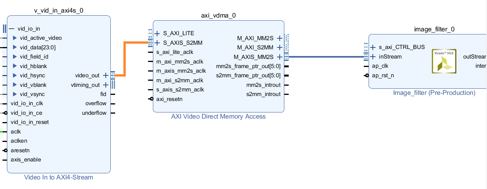


#### 11) Добавить IP-ядро Video Timing Controller (контроллер тайминга видео)

**Введение ядра IP:**

Используйте этот модуль для генерации сигналов управления синхронизацией с различным разрешением

**Конфигурация:**

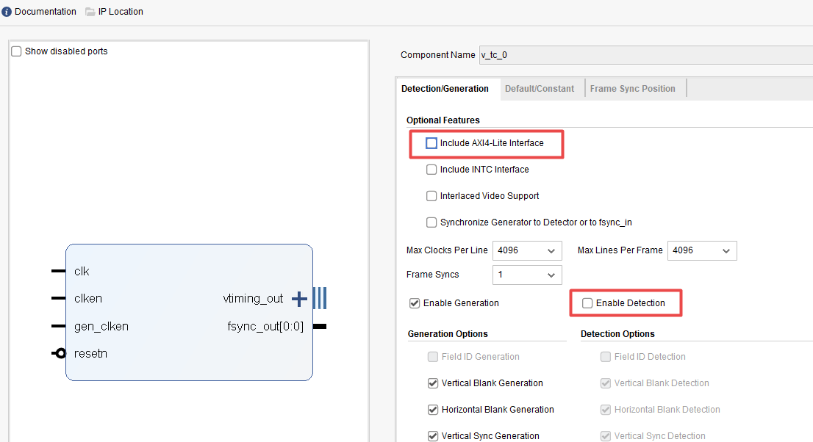


Подключите входной тактовый сигнал и сигнал сброса IP-ядра, как показано на рисунке ниже:


#### 12) Добавьте AXI-Stream to Video out (контроллер видеовыхода)

**Введение ядра IP:**

Этот модуль преобразует AXI4-поток чтения из DDR с помощью VDMA в данные RGB изображения

**Конфигурация:**

Здесь мы используем независимые часы в качестве входа, поэтому выберите независимые часы.


Добавьте логическую схему НЕ, а затем подключите соответствующие сигналы, как показано на рисунке ниже.


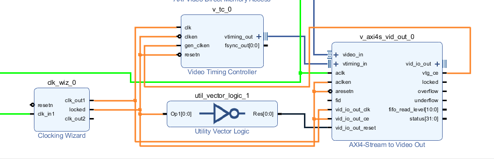


#### 13) Добавить HDMI IP


Здесь мы используем HDMI в виде IP-ядра. В этом эксперименте мы использовали IP-ядро VDMA для реализации вывода изображения HDMI.

**Описание сигналов:**

| Название сигнала | Направление | Описание порта |
| --------------- | ------ | ------------------ |
| clk1x | input | Clock |
| clk5x | input | Clock |
| вход | rst | вход | асинхронный сброс активный высокий уровень |
| image_rgb[23:0] | input | Вход R компонентный |
| vsync | вход | Сигнал синхронизации по полю |
| hsync | вход | сигнал синхронизации линии |
| de | input | Сигнал подтверждения выходных данных |
| hdmi_tx_clk_n | выход | тактовый генератор TMDS |
| hdmi_tx_clk_p | выход | тактовый генератор TMDS | hdmi_tx_clk_n | выход | тактовый генератор TMDS
| hdmi_tx_chn_r_n | выход | данные TMDS |
| hdmi_tx_chn_r_p | выход | данные TMDS |
| hdmi_tx_chn_g_n | выход | данные TMDS | hdmi_tx_chn_r_p | выход | данные TMDS
| hdmi_tx_chn_g_p | выход | данные TMDS | hdmi_tx_chn_g_p | выход | данные TMDS
| hdmi_tx_chn_b_n | выход | данные TMDS | hdmi_tx_chn_b_n | выход | данные TMDS
| hdmi_tx_chn_b_p | выход | данные TMDS |

**Конфигурация:**

Вывести все выходные сигналы и изменить названия сигналов


Сигналы подключения показаны на следующей схеме:


#### 14) Добавить Constant IP

**Введение ядра IP:**

Добавьте модуль постоянного вывода Constant, здесь нам нужно поднять hdmi_opn на высокий уровень, чтобы он всегда работал

**Конфигурация:**

Установить разрядность вывода на 1, вывод высокого уровня в качестве сигнала разрешения вывода HDMI.


экспорта пина


#### 15) Дрбавить Processor System Reset IP

**Введение ядра IP:**

Обеспечить сигнал сброса

**Конфигурация:**

Подключается следующим образом.    


#### 16) Нажмите на Run Connection Automation для автоматического подключения к сигналу.


#### 17) Получим Block Deign 

Окончательное оформление блока показано на рисунке ниже:


#### 18) Создавать файлы HDL верхнего уровня


#### 19) Ограничения штифта

```xdc
set_property PACKAGE_PIN N18 [get_ports {cmos_pclk}]
set_property PACKAGE_PIN Y16 [get_ports {cmos_href}]
set_property PACKAGE_PIN Y19 [get_ports {cmos_vsync}]
set_property PACKAGE_PIN Y17 [get_ports {cmos_rst_n}]
set_property PACKAGE_PIN N17 [get_ports {cmos_sda}]
set_property PACKAGE_PIN P19 [get_ports {cmos_scl}]

set_property PACKAGE_PIN P20 [get_ports {cmos_data[9]}]
set_property PACKAGE_PIN N20 [get_ports {cmos_data[8]}]
set_property PACKAGE_PIN T17 [get_ports {cmos_data[7]}]
set_property PACKAGE_PIN R18 [get_ports {cmos_data[6]}]
set_property PACKAGE_PIN T20 [get_ports {cmos_data[5]}]
set_property PACKAGE_PIN V20 [get_ports {cmos_data[4]}]
set_property PACKAGE_PIN P18 [get_ports {cmos_data[3]}]
set_property PACKAGE_PIN U20 [get_ports {cmos_data[2]}]
set_property PACKAGE_PIN Y18 [get_ports {cmos_data[1]}]
set_property PACKAGE_PIN W20 [get_ports {cmos_data[0]}]

set_property IOSTANDARD LVCMOS33 [get_ports cmos_scl]
set_property IOSTANDARD LVCMOS33 [get_ports cmos_sda]
set_property IOSTANDARD LVCMOS33 [get_ports cmos_rst_n]
set_property IOSTANDARD LVCMOS33 [get_ports cmos_pclk]
set_property IOSTANDARD LVCMOS33 [get_ports cmos_vsync]
set_property IOSTANDARD LVCMOS33 [get_ports cmos_href]
set_property IOSTANDARD LVCMOS33 [get_ports {cmos_data[*]}]

set_property CLOCK_DEDICATED_ROUTE FALSE [get_nets cmos_pclk_IBUF]

set_property PACKAGE_PIN K17 [get_ports hdmi_tx_clk_p]
set_property PACKAGE_PIN G19 [get_ports {hdmi_tx_chn_r_p}]
set_property PACKAGE_PIN F19 [get_ports {hdmi_tx_chn_g_p}]
set_property PACKAGE_PIN D19 [get_ports {hdmi_tx_chn_b_p}]
set_property IOSTANDARD LVCMOS33 [get_ports {hdmi_oen[0]}]
set_property PACKAGE_PIN M20 [get_ports {hdmi_oen[0]}]
set_property IOSTANDARD TMDS_33 [get_ports hdmi_tx_chn_r_p]
set_property IOSTANDARD TMDS_33 [get_ports hdmi_tx_chn_g_p]
set_property IOSTANDARD TMDS_33 [get_ports hdmi_tx_chn_b_p]
set_property IOSTANDARD TMDS_33 [get_ports hdmi_tx_clk_p]
```


#### 20) Сгенерировать битовый поток (Bitstream)


#### 21) Export Hardware（Include Bitstream）


#### 22) Запустить SDK


---


### 3. Программирование с  Xilinx SDK

#### 1) Создать проект


#### 2) Добавить следующие файлы

   ```c
   #include <stdio.h>
   #include "platform.h"
   #include "xil_printf.h"
   #include "vdma_api/vdma_api.h"
   #include "xdocorner.h"
   #include "xparameters.h"
   #include "xil_cache.h"
   
   
   #define DISPLAY_VDMA_DEV_ID 	XPAR_AXI_VDMA_1_DEVICE_ID
   #define HLS_VDMA_DEV_ID 		XPAR_AXI_VDMA_0_DEVICE_ID
   #define CORNER_DEV_ID 			XPAR_DOCORNER_0_DEVICE_ID
   
   
   #define DISP_BASE_ADDR 			0x08000000
   #define HLS_BASE_ADDR			0x03000000
   #define SCREEN_X				1024
   #define SCREEN_Y				768
   
   
   static XAxiVdma					Vdma;
   static XDocorner 				doCorner 	;
   static XDocorner_Config 		*doCorner_Cfg;
   
   
   int initdoCorner(){
   	int status;
   	doCorner_Cfg = XDocorner_LookupConfig(CORNER_DEV_ID);
   	status = XDocorner_CfgInitialize(&doCorner ,doCorner_Cfg);
   	if(status != XST_SUCCESS){
   		printf("initialize failed! \n");
   		return status;
   	}
   	return status;
   }
   
   
   
   //Установить фон монитора
   void setBackground(){
   	u32 *memAddr;
   	int idxRow;
   	int idxCol;
   	memAddr = (u32 *) DISP_BASE_ADDR;
   	for(idxRow = 0;idxRow < SCREEN_Y; idxRow++){
   		for(idxCol = 0;idxCol < SCREEN_X; idxCol++){
   			if(idxRow < SCREEN_Y/2){
   				memAddr[idxCol + idxRow*SCREEN_X] = 0;
   			}
   			else{
   				memAddr[idxCol + idxRow*SCREEN_X] = 0xFFFFFF;
   			}
   		}
   	}
   	Xil_DCacheFlush();
   }
   
   
   
   
   
   int main()
   {
   	printf("initialize running! \n");
   	int status;
       //инициализация VDMA, конфикуряция
   	run_vdma_frame_buffer(&Vdma, HLS_VDMA_DEV_ID, SCREEN_X, SCREEN_Y,HLS_BASE_ADDR,0, 0,BOTH);
   	run_vdma_frame_buffer(&Vdma, DISPLAY_VDMA_DEV_ID, SCREEN_X, SCREEN_Y,DISP_BASE_ADDR,0, 0,BOTH);
   	status = initdoCorner();
   	if(status != XST_SUCCESS){
   		printf("initialize failed! \n");
   		return status;
   	}
   	setBackground();
   
   	while(1){
   		XDocorner_Start(&doCorner);
   		while(!XDocorner_IsDone(&doCorner)){
   
   		}
   	}
       return 0;
   }
   
   ```


### 4. Проверка на плате

#### 1) Соединения портов: 

   - UART, JTAG  -> PC

   - OV5640 камера -  GPIO1

   - HDMI экран - порт HDMI TX

   - Переключатель режима в JTAG

   - Включить плату

     

#### 2) Запускаем на SDK 

#### 3) Запишите битстрим в SDK и запустите его.

Можно заметить, что угловые точки успешно обнаружены и отмечены


## Литература

[Xilinx xp1167 Accelerating OpenCV Applications with Zynq-7000 All Programmable SoC using Vivado HLS Video Libraries](https://www.xilinx.com/support/documentation/application_notes/xapp1167.pdf)

[Xilinx UG902 Vivado Design Suite User Guide High-Level Synthesis](https://china.xilinx.com/support/documentation/sw_manuals/xilinx2020_1/c_ug902-vivado-high-level-synthesis.pdf)

[Datasheet OV5640](https://cdn.sparkfun.com/datasheets/Sensors/LightImaging/OV5640_datasheet.pdf)

[MIZAR Z7 Circuit Schematic]()

[Dcam 5M OV5640 Circuit Schematic]()

[I²C](https://ru.wikipedia.org/wiki/I%C2%B2C)

[Универсальный асинхронный приёмопередатчик](https://ru.wikipedia.org/wiki/%D0%A3%D0%BD%D0%B8%D0%B2%D0%B5%D1%80%D1%81%D0%B0%D0%BB%D1%8C%D0%BD%D1%8B%D0%B9_%D0%B0%D1%81%D0%B8%D0%BD%D1%85%D1%80%D0%BE%D0%BD%D0%BD%D1%8B%D0%B9_%D0%BF%D1%80%D0%B8%D1%91%D0%BC%D0%BE%D0%BF%D0%B5%D1%80%D0%B5%D0%B4%D0%B0%D1%82%D1%87%D0%B8%D0%BA)
