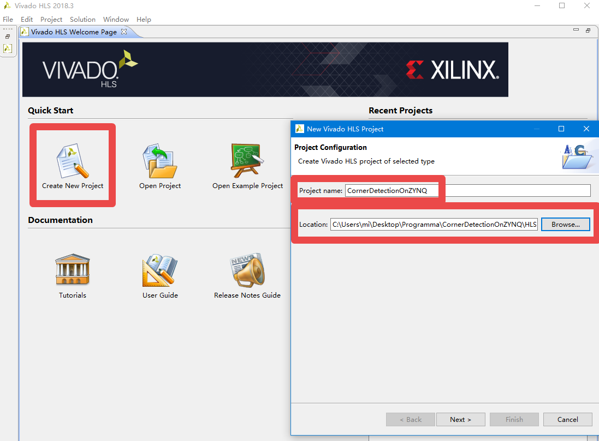
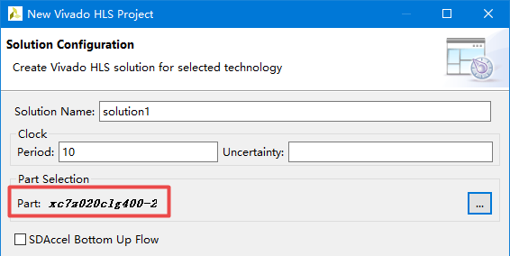
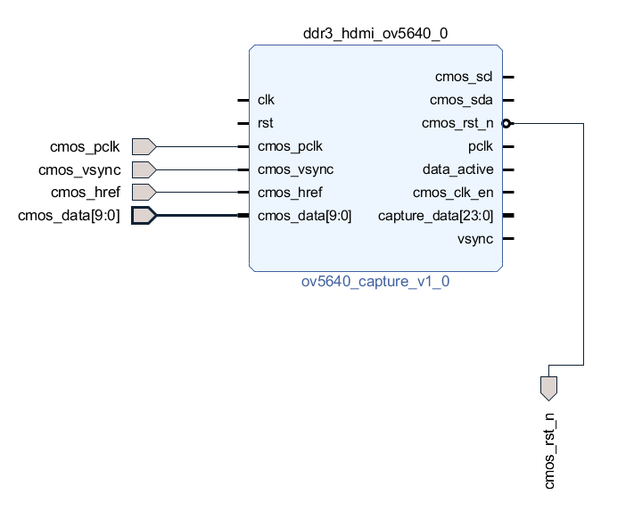
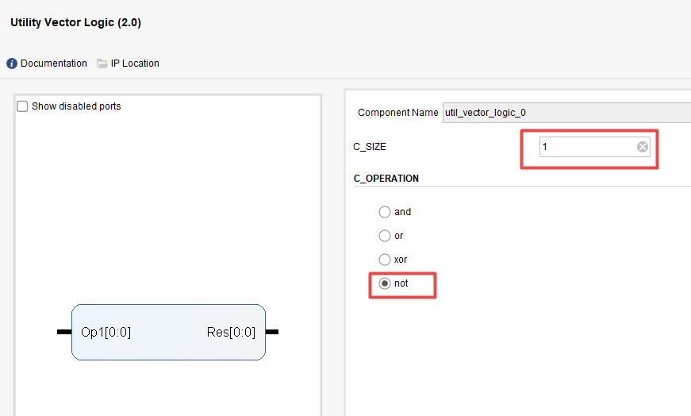
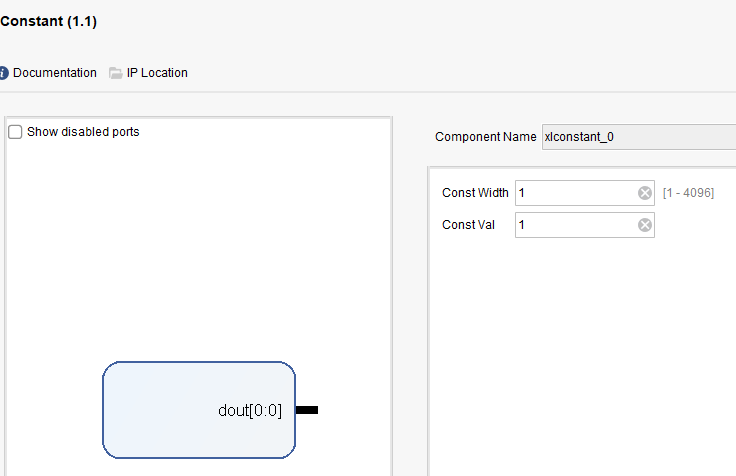
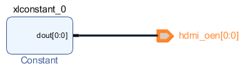
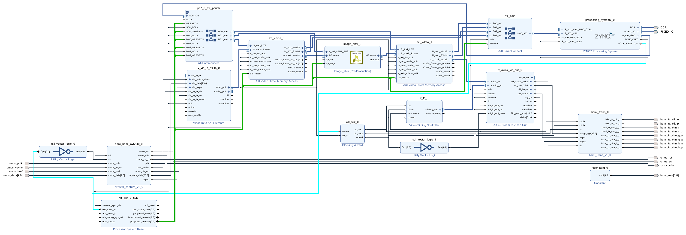

<p align="center">
 
 <h1 align="center">Обнаружение углов на ZYNQ</h2>
 <p align="center"><b>Based on XC7Z020clg400-2 Soc</b></p>
</p>


<div align=center>


 [](LICENSE)


<div align=left>

## Цель проекта

Реализация получения данных изображения в реальном времени камерой OV5640. Отметить положение угловой точки с помощью платы ZYNQ-7. Выводить обработанное изображение в экран через HDMI.

## Аппаратная платформа

- Плата：Mizar Z7
- Процессор：Zynq-7 XC7Z020clg400-2
- Камера：OV5640
- Экран：Xiaomi 34''

## Программная платформа

- Vivado v2018.3
- Xilinx SDK v2018.3
- Vivado HLS v2018.3

## Процесс можно делить на 4 части

1. Разработка с HLS 
2. Дизайн с Vivado
3. Программирование с Xilinx SDK 
4. Проверка на плате

### 1. Разработка с HLS 

1. Открыть Vivado HLS v2018.3 , выбрать `Create New Project`

   

2. Щёлкать `Next`，на `Solution Configuration` выбрать `xc7z020clg400-2`

   

3. Импортировать файл тестового изображения и следующий код

   - CornerDetect.h

     ```C++
     #ifndef __CORNER_HEAD_H_
     #define __CORNER_HEAD_H_
     
     #include "hls_video.h"
     #include "ap_axi_sdata.h"
     
     //размер изображения
     #define WIDTH 1024
     #define HEIGHT 768
     
     //Входные и выходные изображения
     #define SRC_IMAGE "screen.bmp"		//Входное изображение
     #define DST_IMAGE "DstImage.bmp"	//Выходное изображение
     #define GOLD_IMAGE "GoldImage.bmp"	//Путь к эталонному изображению
     
     //Типы данных изображения
     
     //AXI-Stream bitstream
     typedef ap_axiu<24,1,1,1> int_sideChannel;
     typedef hls::stream<ap_axiu<24,1,1,1> > AXI_STREAM ;
     
     //Матрица изображения, где формат пикселей в матрице изображения 3-канальное 8-битное беззнаковое число, изображение RGB
     typedef hls::Mat<HEIGHT,WIDTH,HLS_8UC3> IMAGE_RGB;
     
     //Формат каждого пикселя матрицы изображения, 3-канальный 8-битный беззнаковый тип
     typedef hls::Scalar<3,unsigned char> PIXEL_RGB;
     
     //Матрица изображения, формат пикселей в матрице изображения - 1-канальное 8-битное беззнаковое число, изображение в градациях серого
     typedef hls::Mat<HEIGHT,WIDTH,HLS_8UC1> IMAGE_GRAY;
     
     //Формат каждого пикселя матрицы изображения, 1-канальный 8-битный беззнаковый тип
     typedef hls::Scalar<1,unsigned char> PIXEL_GRAY;
     
     
     //top function
     void rgb2gray(IMAGE_RGB & imgIn, IMAGE_RGB & imgOut_3C, IMAGE_GRAY & imgOut_1C);
     void doCorner(AXI_STREAM & inStream,AXI_STREAM & outStream);
     #endif
     ```

   - CornerDetect.cpp

     ```C++
     #include "CornerDetect.h"
     
     void rgb2gray(IMAGE_RGB & imgIn, IMAGE_RGB & imgOut_3C, IMAGE_GRAY & imgOut_1C){
     	PIXEL_RGB 	pixIn;
     	PIXEL_RGB 	pixOut_3C;
     	PIXEL_GRAY	pixOut_1C;
     
     	for(int idxRow = 0; idxRow < HEIGHT; idxRow++){
     		for(int idxCol = 0; idxCol < WIDTH; idxCol++){
     			//Входное изображение - трехканальное изображение RGB.
     			imgIn >> pixIn;
     			unsigned short R = pixIn.val[0];
     			unsigned short G = pixIn.val[1];
     			unsigned short B = pixIn.val[2];
     
     			//Выводит трехканальное изображение, каждый канал имеет значение серого, а конечное отображаемое изображение - изображение в градациях серого.
     			pixOut_3C.val[0] = (unsigned char) ((R*76 + G*150 + B*30) >> 8);
     			pixOut_3C.val[1] = (unsigned char) ((R*76 + G*150 + B*30) >> 8);
     			pixOut_3C.val[2] = (unsigned char) ((R*76 + G*150 + B*30) >> 8);
     
     			//Вывод одноканального изображения, только с одним каналом, который является изображением в градациях серого.
     			pixOut_1C.val[0] = (unsigned char) ((R*76 + G*150 + B*30) >> 8);
     			imgOut_3C << pixOut_3C;
     			imgOut_1C << pixOut_1C;
     		}
     	}
     }
     
     void doCorner(AXI_STREAM & inStream,AXI_STREAM & outStream){
     #pragma HLS INTERFACE axis  port=outStream
     #pragma HLS INTERFACE axis  port=inStream
     #pragma HLS INTERFACE s_axilite port=return bundle=CTRL_BUS
     
     
     	IMAGE_RGB img_0;
     	IMAGE_RGB img_1;
     	IMAGE_GRAY img_2;
     	IMAGE_RGB img_3;
     	IMAGE_GRAY mask;
     	IMAGE_GRAY dmask;
     
     #pragma HLS dataflow
     #pragma HLS stream depth=20000 variable=img_1_.data_stream
     	hls::AXIvideo2Mat(inStream, img_0);
     	PIXEL_RGB color(255,255,0);
     	rgb2gray(img_0, img_1, img_2);
     	hls::FASTX(img_2, mask, 20, true);			// Быстрое обнаружение стопы
     	hls::Dilate(mask, dmask);					// Развернить обнаруженные точки
     	hls::PaintMask(img_1, dmask, img_3, color);		//Добавить надутую точку к изображению
     	hls::Mat2AXIvideo(img_3, outStream);
     }
     ```

4. на `Test Bench` импортировать следующий тестовый файл

   ```C++
   #include <stdio.h>
   #include <opencv2/opencv.hpp>
   #include "CornerDetect.h"
   #include "hls_opencv.h"
   using namespace cv ;
   
   
   //Сравнение изображений
   int image_compare(const char* output_image, const char* golden_image) {
       if (!(output_image) || !(golden_image)) {
           printf("Failed to open images...exiting.\n");
           return -1;
       } else {
           Mat o = imread(output_image);
           Mat g = imread(golden_image);
           assert(o.rows == g.rows && o.cols == g.cols);	//assert Если это правильно, запускать следующую программу, в противном случае сообщить об ошибке.
           assert(o.channels() == g.channels() && o.depth() == g.depth());
           printf("rows = %d, cols = %d, channels = %d, depth = %d\n", o.rows, o.cols, o.channels(), o.depth());
           int flag = 0;
           for (int i = 0; i < o.rows && flag == 0; i++) {
               for (int j = 0; j < o.cols && flag == 0; j++) {
                   for (int k = 0; k < o.channels(); k++) {
                       unsigned char p_o = (unsigned char)*(o.data + o.step[0]*i + o.step[1]*j + k);
                       unsigned char p_g = (unsigned char)*(g.data + g.step[0]*i + g.step[1]*j + k);
                       if (p_o != p_g) {
                           printf("First mismatch found at row = %d, col = %d\n", i, j);
                           printf("(channel%2d) output:%5d, golden:%5d\n", k, p_o, p_g);
                           flag = 1;
                           break;
                       }
                   }
               }
           }
           if (flag)
               printf("Test Failed!\n");
           else
               printf("Test Passed!\n");
   
           return flag;
       }
   }
   
   int main(){
   	IplImage * SrcImage;				//Входное изображение
   	IplImage * DstImage;				//Выходное изображение
   	SrcImage = cvLoadImage(SRC_IMAGE,-1);//Импортировать изображение
   
   	//Создать выходной образ, поддерживаемый opencv
   	DstImage = cvCreateImage(cvGetSize(SrcImage),SrcImage->depth, SrcImage->nChannels);
   	//AXI-Stream bitstream
   	AXI_STREAM inStream;
   	AXI_STREAM outStream;
   
   	IplImage2AXIvideo(SrcImage,inStream);
   
   	//Синтезируемая функция
   	doCorner(inStream, outStream);
   	//Сохронить выходный результат
   	AXIvideo2IplImage(outStream,DstImage);
   	cvSaveImage(DST_IMAGE,DstImage);
   
   	//Вывод эталонного изображения
   	cvShowImage(DST_IMAGE, DstImage);
   	cvWaitKey(0);
   
   
   	//Освобождение изоброжений
   	cvReleaseImage(&SrcImage);
   	cvReleaseImage(&DstImage);
   	return 0;
   }
   ```

5. Выполнить по пункту:

   1. Run C Simulatoin（симуляция）
   2. Run C Synthesis（Синтез）
   3. Run C/RTL Cosimulation（Косимуляция）
   4. Export RTL

   Мы получим нужный IP для обработки изображений

### 2. Дизайн на Vivado

1. Создать новый Vivado прект

2. Импортировать настраиваемое IP-ядро

   

3. Добавить`ZYNQ-7` IP

   - Разрешить порт UART 

   - Напряжение Bank 1 установится как 1.8V

     

   - Вывеодить соответствующий штифт

     Конфигурация выполнилась, как показано на рисунке ниже:

     

4. Добавить IP ядро камеры OV5640

   Выводить сигнал порта, подключенный к внешнему контакту, и изменить названия сигнала, чтобы облегчить идентификацию и ограничения контактов. Сигнал, который нужно нарисовать, показан на рисунке ниже:

   

   Использовать выходные часы ПК в качестве тактовых импульсов привода IP и подключите тактовый сигнал, как показано на рисунке ниже.：

   

5. Добавить видео в IP ядро AXI4-Stream (контроллер вывода видео)

   Установить режим часов в независимый режим (Independent)

   

   И подключить сигнал камеры OV5640 следующим образом

   

6. Добавить IP-ядро мастера синхронизации

   Установить входную тактовую частоту на 50 МГц, установить выходную частоту тактовых импульсов 1 на 65 МГц, установить частоту тактовых импульсов 2 на 325 МГц и установить для сигнала сброса низкий активный уровень.

   

   

7. Добавить IP логической схемы логического элемента Vector Logic

   Установить схему затвора на 1 бит и инвертируйте ее.

   

8. Подключить часы и сбросьте сигнал

   

9. Добавить два IP-адреса VDMA

   > Используйте IP-ядро VDMA для реализации прямого хранения в памяти с высокой пропускной способностью или чтения для целевых периферийных устройств AXI4-Stream для чтения данных в DDR. После того, как VDMA считывает данные, он преобразует поток данных в поток данных видеопротокола через IP-ядро AXI4-Stream to Video Out.

   Опция `Frame Buffers` может выбрать количество обрабатываемых мест хранения буфера кадра AXI VDMA 。Поскольку в этом эксперименте с отображением отображается только одно изображение, данные необходимо записать только один раз, поэтому нет необходимости устанавливать несколько областей буфера кадра, здесь он установлен на 1. Поскольку в этом эксперименте данные считываются с DDR3 и выводятся на ЖК-дисплей, вам нужно только установить флажок «Включить канал чтения» вместо «Включить канал записи».

   `Memory Map Data Width` Ширина данных AXI4б, 64 по умолчанию

   `Write/Read Burst Size` Указать размер пакета для записи / чтения, выберём здесь 32

   `Stream Data Width` выбрать ширину данных AXI4-Stream канала MM2S. **Здесь, поскольку формат выходных данных - RGB888, он установлен на 24 **

   `Line Buffer Depth` Выбрать глубину строкового буфера канала MM2S (ширина строчного буфера - это размер потоковых данных), установите здесь **512 **

   

10. Импорт IP-ядра обработки видео

    Подключить видеовыход входной сигнал

    

11. Соединение порта вывода видеосигнала Video in to AXI4-Stream IP ( `video_out` ) и порта ввода данных VDMA ( `S_AXIS_S2MM`)

    

12. Импорт таймингового IP ядра (контроллер тайминга видео)

    Конфигурация:

    

    

    Соединить входной тактовый сигнал и сигнал сброса IP ядра

    

13. Импорт Video out（视频输出控制器）

    Здесь мы используем независимые часы в качестве входа, поэтому выберите независимые часы.

    

14. Добавьте логическую схему НЕ, а затем подключите соответствующие сигналы, как показано на рисунке ниже.

    

    

15. Добавить HDMI IP

    Выведите все выходные сигналы и измените имя сигнала

    

    Подключения сигналов

    

16. Добавить Constant IP

    Установить разрядность вывода на 1, вывод высокого уровня в качестве сигнала разрешения вывода HDMI.

    

    экспорта пина

    

17. Дрбавить Processor System Reset IP

    

    

18. Run Connection Automation 

19. Получим Block Deign 

    

20. Создавать файлы HDL верхнего уровня

21. Ограничения штифта

    ```xdc
    set_property PACKAGE_PIN N18 [get_ports {cmos_pclk}]
    set_property PACKAGE_PIN Y16 [get_ports {cmos_href}]
    set_property PACKAGE_PIN Y19 [get_ports {cmos_vsync}]
    set_property PACKAGE_PIN Y17 [get_ports {cmos_rst_n}]
    set_property PACKAGE_PIN N17 [get_ports {cmos_sda}]
    set_property PACKAGE_PIN P19 [get_ports {cmos_scl}]
    
    set_property PACKAGE_PIN P20 [get_ports {cmos_data[9]}]
    set_property PACKAGE_PIN N20 [get_ports {cmos_data[8]}]
    set_property PACKAGE_PIN T17 [get_ports {cmos_data[7]}]
    set_property PACKAGE_PIN R18 [get_ports {cmos_data[6]}]
    set_property PACKAGE_PIN T20 [get_ports {cmos_data[5]}]
    set_property PACKAGE_PIN V20 [get_ports {cmos_data[4]}]
    set_property PACKAGE_PIN P18 [get_ports {cmos_data[3]}]
    set_property PACKAGE_PIN U20 [get_ports {cmos_data[2]}]
    set_property PACKAGE_PIN Y18 [get_ports {cmos_data[1]}]
    set_property PACKAGE_PIN W20 [get_ports {cmos_data[0]}]
    
    set_property IOSTANDARD LVCMOS33 [get_ports cmos_scl]
    set_property IOSTANDARD LVCMOS33 [get_ports cmos_sda]
    set_property IOSTANDARD LVCMOS33 [get_ports cmos_rst_n]
    set_property IOSTANDARD LVCMOS33 [get_ports cmos_pclk]
    set_property IOSTANDARD LVCMOS33 [get_ports cmos_vsync]
    set_property IOSTANDARD LVCMOS33 [get_ports cmos_href]
    set_property IOSTANDARD LVCMOS33 [get_ports {cmos_data[*]}]
    
    set_property CLOCK_DEDICATED_ROUTE FALSE [get_nets cmos_pclk_IBUF]
    
    set_property PACKAGE_PIN K17 [get_ports hdmi_tx_clk_p]
    set_property PACKAGE_PIN G19 [get_ports {hdmi_tx_chn_r_p}]
    set_property PACKAGE_PIN F19 [get_ports {hdmi_tx_chn_g_p}]
    set_property PACKAGE_PIN D19 [get_ports {hdmi_tx_chn_b_p}]
    set_property IOSTANDARD LVCMOS33 [get_ports {hdmi_oen[0]}]
    set_property PACKAGE_PIN M20 [get_ports {hdmi_oen[0]}]
    set_property IOSTANDARD TMDS_33 [get_ports hdmi_tx_chn_r_p]
    set_property IOSTANDARD TMDS_33 [get_ports hdmi_tx_chn_g_p]
    set_property IOSTANDARD TMDS_33 [get_ports hdmi_tx_chn_b_p]
    set_property IOSTANDARD TMDS_33 [get_ports hdmi_tx_clk_p]
    ```

22. Сгенерировать битовый поток

23. Export Hardware（Include Bitstream）

24. Запустить SDK

### 3.Программирование с  Xilinx SDK 

1. Создать проект

2. Добавить следующие файлы

   ```c
   #include <stdio.h>
   #include "platform.h"
   #include "xil_printf.h"
   #include "vdma_api/vdma_api.h"
   #include "xdocorner.h"
   #include "xparameters.h"
   #include "xil_cache.h"
   
   
   #define DISPLAY_VDMA_DEV_ID 	XPAR_AXI_VDMA_1_DEVICE_ID
   #define HLS_VDMA_DEV_ID 		XPAR_AXI_VDMA_0_DEVICE_ID
   #define CORNER_DEV_ID 			XPAR_DOCORNER_0_DEVICE_ID
   
   
   #define DISP_BASE_ADDR 			0x08000000
   #define HLS_BASE_ADDR			0x03000000
   #define SCREEN_X				1024
   #define SCREEN_Y				768
   
   
   static XAxiVdma					Vdma;
   static XDocorner 				doCorner 	;
   static XDocorner_Config 		*doCorner_Cfg;
   
   
   int initdoCorner(){
   	int status;
   	doCorner_Cfg = XDocorner_LookupConfig(CORNER_DEV_ID);
   	status = XDocorner_CfgInitialize(&doCorner ,doCorner_Cfg);
   	if(status != XST_SUCCESS){
   		printf("initialize failed! \n");
   		return status;
   	}
   	return status;
   }
   
   
   
   //Установить фон монитора
   void setBackground(){
   	u32 *memAddr;
   	int idxRow;
   	int idxCol;
   	memAddr = (u32 *) DISP_BASE_ADDR;
   	for(idxRow = 0;idxRow < SCREEN_Y; idxRow++){
   		for(idxCol = 0;idxCol < SCREEN_X; idxCol++){
   			if(idxRow < SCREEN_Y/2){
   				memAddr[idxCol + idxRow*SCREEN_X] = 0;
   			}
   			else{
   				memAddr[idxCol + idxRow*SCREEN_X] = 0xFFFFFF;
   			}
   		}
   	}
   	Xil_DCacheFlush();
   }
   
   
   
   
   
   int main()
   {
   	printf("initialize running! \n");
   	int status;
       //инициализация VDMA, конфикуряция
   	run_vdma_frame_buffer(&Vdma, HLS_VDMA_DEV_ID, SCREEN_X, SCREEN_Y,HLS_BASE_ADDR,0, 0,BOTH);
   	run_vdma_frame_buffer(&Vdma, DISPLAY_VDMA_DEV_ID, SCREEN_X, SCREEN_Y,DISP_BASE_ADDR,0, 0,BOTH);
   	status = initdoCorner();
   	if(status != XST_SUCCESS){
   		printf("initialize failed! \n");
   		return status;
   	}
   	setBackground();
   
   	while(1){
   		XDocorner_Start(&doCorner);
   		while(!XDocorner_IsDone(&doCorner)){
   
   		}
   	}
       return 0;
   }
   
   ```

### 4. Проверка на плате

1. Соединения портов: 

   - UART, JTAG  -> PC

   - OV5640 камера -  GPIO1

   - HDMI экран - порт HDMI TX

   - Переключатель режима в JTAG

   - Включить плату

     

2. Запускаем на SDK 

3. Увидим, что угловые точки успешно обнаружены и **отмечены**

   


## Литература:

[Xilinx xp1167 Accelerating OpenCV Applications with Zynq-7000 All Programmable SoC using Vivado HLS Video Libraries](https://www.xilinx.com/support/documentation/application_notes/xapp1167.pdf)

[Xilinx UG902 Vivado Design Suite User Guide High-Level Synthesis](https://china.xilinx.com/support/documentation/sw_manuals/xilinx2020_1/c_ug902-vivado-high-level-synthesis.pdf)

[Datasheet OV5640](https://cdn.sparkfun.com/datasheets/Sensors/LightImaging/OV5640_datasheet.pdf)

[MIZAR Z7 Circuit Schematic]()

[Dcam 5M OV5640 Circuit Schematic]()


